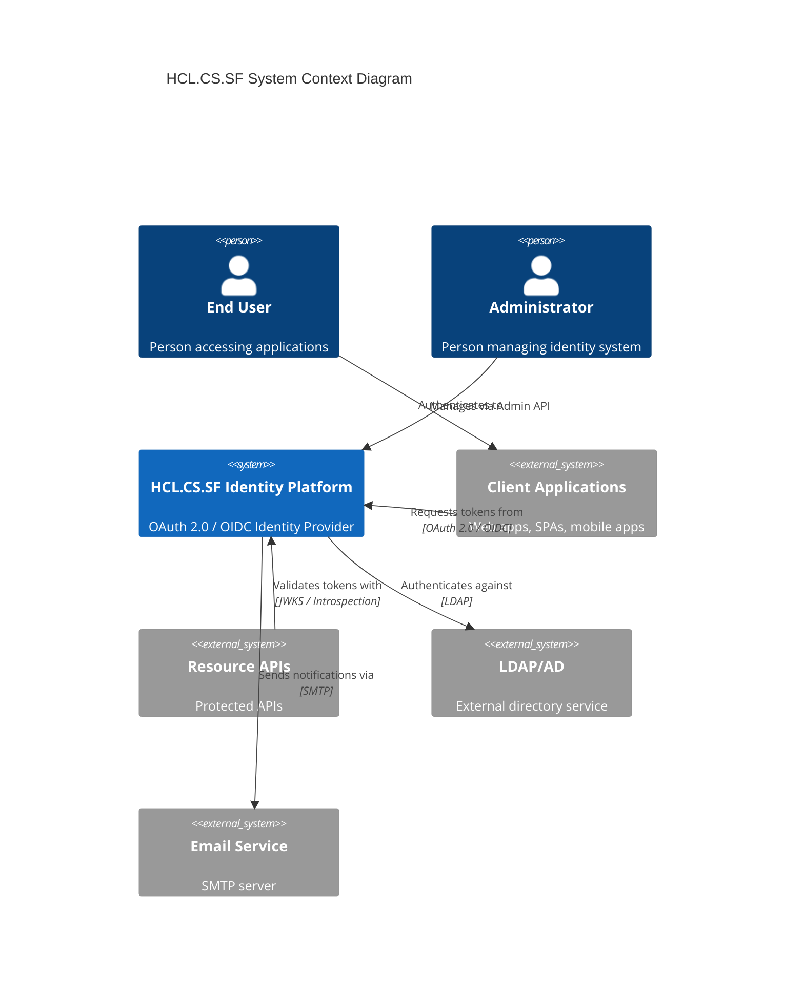

# HCL.CS.SF System Overview

**Document ID:** HCL.CS.SF-DOC-01-SYSTEM-OVERVIEW  
**Version:** 1.0.0  
**Classification:** Internal Use  
**Last Updated:** 2026-03-01  

---

## Table of Contents

1. [Executive Summary](#1-executive-summary)
2. [System Boundaries](#2-system-boundaries)
3. [Core Components](#3-core-components)
4. [Supported OAuth/OIDC Flows](#4-supported-oauthoidc-flows)
5. [Supported Database Engines](#5-supported-database-engines)
6. [Tenant Model](#6-tenant-model)
7. [Integration Points](#7-integration-points)

---

## 1. Executive Summary

### 1.1 What HCL.CS.SF Is

HCL.CS.SF is an **OAuth 2.0 and OpenID Connect (OIDC) identity provider** built on .NET 8. It provides enterprise-grade authentication and authorization services for modern applications. This documentation covers the **legacy implementation** of HCL.CS.SF as it exists in the repository today.

**Key Capabilities:**
- OAuth 2.0 token issuance (access tokens, refresh tokens, identity tokens)
- OpenID Connect authentication flows
- User and role management (RBAC)
- Client application registration and management
- API resource and scope management
- Audit trail and security logging

### 1.2 System Purpose

HCL.CS.SF serves as a centralized identity provider enabling:

| Use Case | Description |
|----------|-------------|
| **Single Sign-On (SSO)** | Users authenticate once and access multiple applications |
| **API Security** | Protect APIs with OAuth 2.0 bearer tokens |
| **Microservices Auth** | Centralized token issuance for distributed systems |
| **Third-Party Integration** | Enable external applications to authenticate via OAuth 2.0 |

### 1.3 Standards Compliance

| Standard | Status | Implementation Reference |
|----------|--------|-------------------------|
| OAuth 2.0 (RFC 6749) | ✅ Implemented | `/src/Identity/HCL.CS.SF.Identity.Application/Implementation/Endpoint/` |
| OpenID Connect Core 1.0 | ✅ Implemented | Same as above |
| PKCE (RFC 7636) | ✅ Mandatory | `ProofKeyParametersSpecification.cs` |
| JWT (RFC 7519) | ✅ Implemented | `TokenGenerationService.cs` |
| JWKS (RFC 7517) | ✅ Implemented | `JwksEndpoint.cs` |
| Token Introspection (RFC 7662) | ✅ Implemented | `IntrospectionEndpoint.cs` |
| Token Revocation (RFC 7009) | ✅ Implemented | `TokenRevocationEndpoint.cs` |

---

## 2. System Boundaries

### 2.1 System Context Diagram



### 2.2 In-Scope Components

| Component | Path | Responsibility |
|-----------|------|----------------|
| **Identity API** | `/src/Identity/HCL.CS.SF.Identity.API/` | HTTP hosting, health checks |
| **Application Layer** | `/src/Identity/HCL.CS.SF.Identity.Application/` | Endpoint implementations, services |
| **Domain Layer** | `/src/Identity/HCL.CS.SF.Identity.Domain/` | Entities, models, constants |
| **Infrastructure** | `/src/Identity/HCL.CS.SF.Identity.Infrastructure*/` | Email, SMS, resources |
| **Persistence** | `/src/Identity/HCL.CS.SF.Identity.Persistence/` | EF Core, repositories, migrations |
| **Gateway** | `/src/Gateway/HCL.CS.SF.Gateway/` | Proxy services, middleware |
| **Installer** | `/installer/HCL.CS.SF.Installer.Mvc/` | Database provisioning, seeding |
| **Demo Clients** | `/demos/` | Example applications |

### 2.3 Out-of-Scope Components

| Component | Status | Notes |
|-----------|--------|-------|
| Admin UI | Placeholder only | `/src/Admin/` scaffolded for future development |
| Event Bus | Not present | Not in legacy implementation scope |
| Multi-region replication | Not present | Single-region deployment |
| Identity Server integration | Not present | Custom implementation, not using IdentityServer4 |

---

## 3. Core Components

### 3.1 Identity Service

The Identity Service is the core OAuth/OIDC token issuance engine.

**Source Files:**
- Entry point: `/src/Identity/HCL.CS.SF.Identity.API/Program.cs`
- Endpoints: `/src/Identity/HCL.CS.SF.Identity.Application/Implementation/Endpoint/`
- Services: `/src/Identity/HCL.CS.SF.Identity.Application/Implementation/Api/Services/`

**Key Responsibilities:**
| Function | Implementation File |
|----------|---------------------|
| Token generation | `TokenGenerationService.cs` |
| Client validation | `ClientSecretValidator.cs` |
| Authorization code flow | `AuthorizationService.cs` |
| Session management | `SessionManagementService.cs` |
| Discovery metadata | `DiscoveryService.cs` |

### 3.2 Gateway

The Gateway provides reverse proxy capabilities with observability and security middleware.

**Source Files:**
- `/src/Gateway/HCL.CS.SF.Gateway/`

**Key Responsibilities:**
| Function | Implementation File |
|----------|---------------------|
| Routing | `Routes/ApiGateway.cs` |
| Correlation ID propagation | `Hosting/CorrelationIdMiddleware.cs` |
| Security headers | `Hosting/SecurityHeadersMiddleware.cs` |
| Request observability | `Hosting/RequestObservabilityMiddleware.cs` |
| Log redaction | `Hosting/LogRedactionHelper.cs` |

### 3.3 Installer

The Installer is an MVC application for initial system setup.

**Source Files:**
- `/installer/HCL.CS.SF.Installer.Mvc/`

**Key Responsibilities:**
| Function | Implementation File |
|----------|---------------------|
| Database provisioning | `Infrastructure/Services/DatabaseProvisioning/` |
| Migration execution | `Infrastructure/Services/DatabaseMigrationService.cs` |
| Data seeding | `Infrastructure/Services/SeedDataService.cs` |
| Connection validation | `Infrastructure/Services/DatabaseProviderUtilities.cs` |

**Supported Database Providers:**
- SQL Server (`SqlServerProvisioner.cs`)
- MySQL (`MySqlProvisioner.cs`)
- PostgreSQL (`PostgreSqlProvisioner.cs`)
- SQLite (`SqliteProvisioner.cs`)

### 3.4 Demo Applications

Demo applications demonstrate integration patterns.

| Demo | Path | Purpose |
|------|------|---------|
| Demo Server | `/demos/HCL.CS.SF.Demo.Server/` | Hosts Identity Service runtime |
| Demo MVC Client | `/demos/HCL.CS.SF.Demo.Client.Mvc/` | Web client example |
| Demo WPF Client | `/demos/HCL.CS.SF.Demo.Client.Wpf/` | Desktop client example |

---

## 4. Supported OAuth/OIDC Flows

### 4.1 Flow Implementation Matrix

| Flow | Status | Implementation Evidence |
|------|--------|------------------------|
| Authorization Code + PKCE | ✅ Supported | `AuthorizeCodeFlowSpecification.cs` |
| Client Credentials | ✅ Supported | `ClientCredentialsFlowSpecification.cs` |
| Refresh Token | ✅ Supported | `RefreshTokenFlowSpecification.cs` |
| Resource Owner Password | ⚠️ Supported (deprecated) | `ResourceOwnerFlowSpecification.cs` |
| Implicit Flow | ❌ Disabled | Not implemented per security policy |
| Hybrid Flow | ❌ Disabled | Not implemented |

### 4.2 Endpoint Inventory

| Endpoint | Route | Methods | Implementation |
|----------|-------|---------|----------------|
| Discovery | `/.well-known/openid-configuration` | GET | `DiscoveryEndpoint.cs` |
| JWKS | `/.well-known/openid-configuration/jwks` | GET | `JwksEndpoint.cs` |
| Authorize | `/security/authorize` | GET, POST | `AuthorizeEndpoint.cs` |
| Authorize Callback | `/security/authorize/authorizecallback` | GET, POST | `AuthorizeCallBackEndpoint.cs` |
| Token | `/security/token` | POST | `TokenEndpoint.cs` |
| UserInfo | `/security/userinfo` | GET, POST | `UserInfoEndpoint.cs` |
| Introspection | `/security/introspect` | POST | `IntrospectionEndpoint.cs` |
| Revocation | `/security/revocation` | POST | `TokenRevocationEndpoint.cs` |
| End Session | `/security/endsession` | GET | `EndSessionEndpoint.cs` |
| End Session Callback | `/security/endsession/callback` | GET | `EndSessionCallbackEndpoint.cs` |

### 4.3 Grant Type Constants

Source: `/src/Identity/HCL.CS.SF.Identity.Domain/Constants/Endpoint/OpenIdConstants.cs`

```csharp
public static class GrantTypes
{
    public const string Password = "password";                    // Resource Owner
    public const string AuthorizationCode = "authorization_code"; // Authorization Code
    public const string ClientCredentials = "client_credentials"; // Client Credentials
    public const string RefreshToken = "refresh_token";          // Refresh Token
}
```

### 4.4 Response Type Support

| Response Type | Status | Notes |
|---------------|--------|-------|
| `code` | ✅ Supported | Authorization code flow |
| `token` | ❌ Disabled | Implicit flow not supported |
| `id_token` | ❌ Disabled | Implicit flow not supported |
| `code id_token` | ❌ Disabled | Hybrid flow not supported |

---

## 5. Supported Database Engines

### 5.1 Database Provider Support

Source: `/installer/HCL.CS.SF.Installer.Mvc/Application/DTOs/DatabaseProviderType.cs`

| Provider | Enum Value | EF Provider | Status |
|----------|------------|-------------|--------|
| SQL Server | `SqlServer = 1` | Microsoft.EntityFrameworkCore.SqlServer | ✅ Supported |
| MySQL | `MySql = 2` | Pomelo.EntityFrameworkCore.MySql | ✅ Supported |
| PostgreSQL | `PostgreSql = 3` | Npgsql.EntityFrameworkCore.PostgreSQL | ✅ Supported |
| SQLite | `Sqlite = 4` | Microsoft.EntityFrameworkCore.Sqlite | ✅ Supported |

### 5.2 Provider-Specific Implementations

| Provider | DbContext | Migration Path |
|----------|-----------|----------------|
| SQL Server | `SqlServerApplicationDbContext` | `Migrations/Sql/` |
| MySQL | `MySqlApplicationDbContext` | `Migrations/MySql/` |
| PostgreSQL | `PostgreSqlApplicationDbcontext` | `Migrations/PostgreSql/` |
| SQLite | `SqLiteApplicationDbContext` | `Migrations/Sqlite/` |

### 5.3 Multi-Database Strategy

The system uses a provider-specific DbContext factory pattern:

Source: `/installer/HCL.CS.SF.Installer.Mvc/Infrastructure/Persistence/Data/`

```csharp
// Factory pattern for database provisioning
public class DatabaseProvisionerFactory
{
    public IDatabaseProvisioner CreateProvisioner(DatabaseProviderType providerType)
    {
        return providerType switch
        {
            DatabaseProviderType.SqlServer => new SqlServerProvisioner(),
            DatabaseProviderType.MySql => new MySqlProvisioner(),
            DatabaseProviderType.PostgreSql => new PostgreSqlProvisioner(),
            DatabaseProviderType.Sqlite => new SqliteProvisioner(),
            _ => throw new NotSupportedException()
        };
    }
}
```

---

## 6. Tenant Model

### 6.1 Tenant Support Status

**Status: Not present in legacy repo scope**

The legacy HCL.CS.SF implementation does **not** include multi-tenant architecture. The codebase contains tenant-related interfaces (`ITenantContext`) but no complete multi-tenant isolation implementation.

### 6.2 Tenant Interfaces Present

| Interface | Path | Purpose |
|-----------|------|---------|
| `ITenantContext` | `/src/Identity/HCL.CS.SF.Identity.DomainServices/Infra/ITenantContext.cs` | Tenant context abstraction |
| `HttpTenantContext` | `/src/Identity/HCL.CS.SF.Identity.Infrastructure/Implementation/HttpTenantContext.cs` | HTTP-based tenant resolution |

### 6.3 Current Behavior

The system operates as a **single-tenant** identity provider. All data resides in a single database schema without tenant isolation.

---

## 7. Integration Points

### 7.1 External Service Integrations

| Service | Integration Type | Configuration |
|---------|-----------------|---------------|
| **LDAP/Active Directory** | Authentication provider | `LdapConfig` in `HCL.CS.SFConfig` |
| **SMTP Server** | Email notifications | `EmailConfig` in `HCL.CS.SFConfig` |
| **SMS Provider** | SMS notifications | `SmsConfig` in `HCL.CS.SFConfig` |

### 7.2 Client Application Types

| Type | Enum Value | Characteristics |
|------|------------|-----------------|
| Web Application | `Web` | Confidential client, server-side |
| Single Page Application | `SPA` | Public client, PKCE required |
| Native Application | `NativeApp` | Public client, PKCE required |

Source: `/src/Identity/HCL.CS.SF.Identity.Domain/Enums/ApiEnums.cs`

### 7.3 Authentication Methods

| Method | Status | Use Case |
|--------|--------|----------|
| Local (username/password) | ✅ Supported | Built-in user store |
| LDAP/AD | ✅ Supported | Enterprise directory integration |
| External OAuth | ⚠️ Partial | Framework present, specific providers not implemented |

### 7.4 Multi-Factor Authentication

| MFA Type | Enum Value | Status |
|----------|------------|--------|
| None | `None` | ✅ Supported |
| Email OTP | `Email` | ✅ Supported |
| SMS OTP | `SMS` | ✅ Supported |
| Authenticator App | `Authenticator` | ✅ Supported |

Source: `/src/Identity/HCL.CS.SF.Identity.Domain/Enums/ApiEnums.cs` - `TwoFactorType`

---

## 8. System Limitations

### 8.1 Known Limitations

| Limitation | Details | Workaround |
|------------|---------|------------|
| No multi-tenancy | Single tenant only | Deploy separate instances per tenant |
| No event bus | No distributed events | Use direct database polling or add custom event system |
| Single region | No built-in geo-replication | Use database replication and load balancing |
| Admin UI incomplete | Scaffolded only | Use API directly or build custom admin UI |

### 8.2 Scoping Notes

This documentation reflects the **legacy implementation** as it exists in the repository. Future development may add:
- Multi-tenant architecture
- Event-driven notifications
- Enhanced Admin UI
- Additional OAuth flows (Device Code, etc.)

---

## 9. Quick Reference

### 9.1 Default Ports (Local Development)

| Service | URL | Project |
|---------|-----|---------|
| Identity Server | `https://localhost:5001` | `HCL.CS.SF.Demo.Server` |
| MVC Client | `https://localhost:5003` | `HCL.CS.SF.DemoClientMvc` |
| Installer | `https://localhost:7039` | `HCL.CS.SF.Installer.Mvc` |

### 9.2 Key Configuration Files

| File | Purpose |
|------|---------|
| `appsettings.json` | Application configuration |
| `HCL.CS.SFConfig.cs` | Domain configuration model |
| `Directory.Build.props` | MSBuild properties |
| `Directory.Packages.props` | NuGet package versions |

---

## Version History

| Version | Date | Author | Changes |
|---------|------|--------|---------|
| 1.0.0 | 2026-03-01 | Enterprise Documentation Team | Initial release |
