# HCL.CS.SF Architecture

**Document ID:** HCL.CS.SF-DOC-02-ARCHITECTURE  
**Version:** 1.0.0  
**Classification:** Internal Use  
**Last Updated:** 2026-03-01  

---

## Table of Contents

1. [C4 Context Diagram](#1-c4-context-diagram)
2. [C4 Container Diagram](#2-c4-container-diagram)
3. [Identity Service Architecture](#3-identity-service-architecture)
4. [Gateway Architecture](#4-gateway-architecture)
5. [Installer Architecture](#5-installer-architecture)
6. [Communication Patterns](#6-communication-patterns)
7. [Deployment Shapes](#7-deployment-shapes)

---

## 1. C4 Context Diagram

### 1.1 System Context

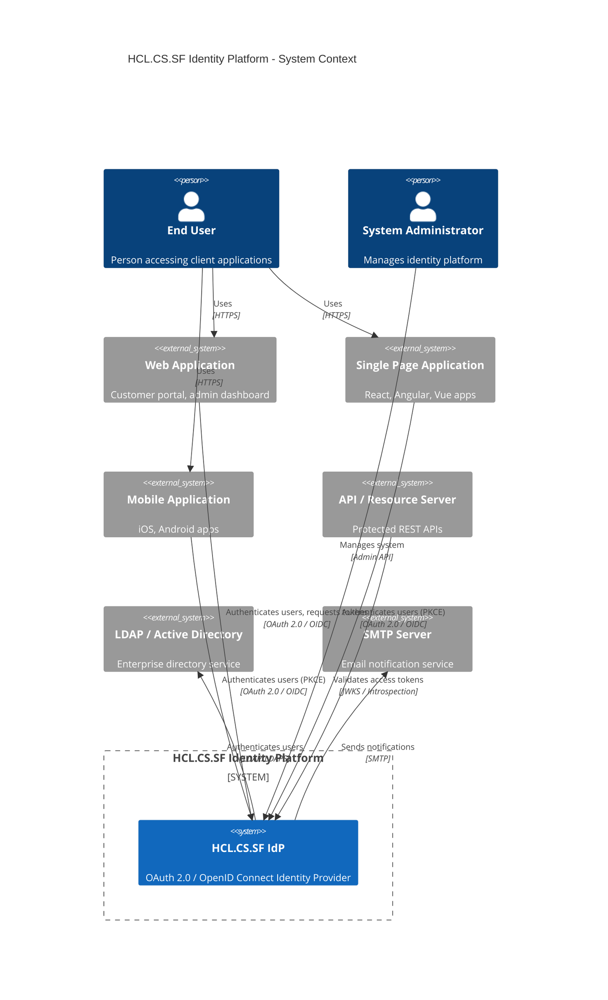

### 1.2 External Actors

| Actor | Description | Integration Protocol |
|-------|-------------|---------------------|
| End User | Person authenticating to applications | Browser/HTTP |
| System Administrator | Person managing identity configuration | HTTPS/Admin API |
| Web Application | Server-rendered applications | OAuth 2.0 Authorization Code |
| SPA | Browser-based JavaScript applications | OAuth 2.0 + PKCE |
| Mobile App | Native mobile applications | OAuth 2.0 + PKCE |
| API / Resource Server | Protected resource APIs | Token validation |
| LDAP/AD | Enterprise directory | LDAP/LDAPS |
| SMTP Server | Email delivery | SMTP/SMTPS |

---

## 2. C4 Container Diagram

### 2.1 Container Overview

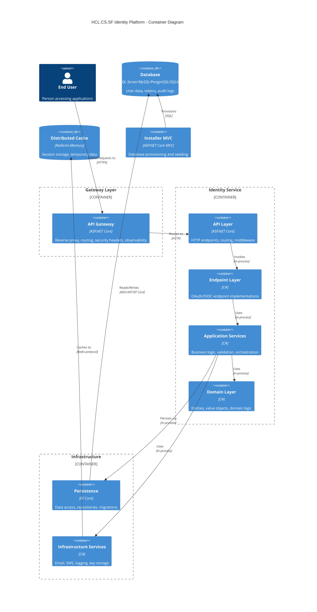

### 2.2 Container Responsibilities

| Container | Technology | Primary Responsibility | Source Location |
|-----------|------------|----------------------|-----------------|
| **API Gateway** | ASP.NET Core | Request routing, security headers, correlation IDs, observability | `/src/Gateway/HCL.CS.SF.Gateway/` |
| **Identity API** | ASP.NET Core | HTTP hosting, endpoint mapping, middleware pipeline | `/src/Identity/HCL.CS.SF.Identity.API/` |
| **Endpoint Layer** | C# / .NET 8 | OAuth/OIDC protocol implementations | `/src/Identity/HCL.CS.SF.Identity.Application/Implementation/Endpoint/` |
| **Application Services** | C# / .NET 8 | Business logic, validation, specifications | `/src/Identity/HCL.CS.SF.Identity.Application/Implementation/Api/` |
| **Domain Layer** | C# / .NET 8 | Entities, models, constants, enums | `/src/Identity/HCL.CS.SF.Identity.Domain/` |
| **Persistence** | EF Core 8 | Data access, repositories, mappings | `/src/Identity/HCL.CS.SF.Identity.Persistence/` |
| **Infrastructure** | C# / .NET 8 | External service integrations | `/src/Identity/HCL.CS.SF.Identity.Infrastructure/` |
| **Installer** | ASP.NET Core MVC | Database setup, migrations, seeding | `/installer/HCL.CS.SF.Installer.Mvc/` |

---

## 3. Identity Service Architecture

### 3.1 Layered Architecture

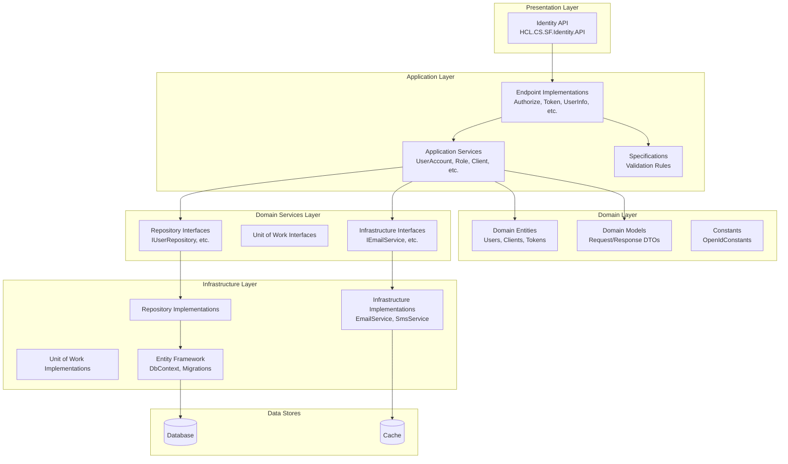

### 3.2 Layer Details

#### 3.2.1 API Layer (`HCL.CS.SF.Identity.API`)

**Source:** `/src/Identity/HCL.CS.SF.Identity.API/`

| Component | Purpose | Key Files |
|-----------|---------|-----------|
| Program.cs | Application entry point, DI configuration | `Program.cs` |
| Extensions | Custom middleware registration, HCL.CS.SF builder | `Extensions/HCL.CS.SFBuilder.cs`, `Extensions/HCL.CS.SFExtension.cs` |
| Health Checks | Dependency health verification | `Health/DatabaseDependencyHealthCheck.cs`, `Health/CacheDependencyHealthCheck.cs` |

#### 3.2.2 Application Layer (`HCL.CS.SF.Identity.Application`)

**Source:** `/src/Identity/HCL.CS.SF.Identity.Application/`

| Sub-Component | Purpose | Key Files |
|---------------|---------|-----------|
| **Endpoints** | OAuth/OIDC protocol handlers | `Implementation/Endpoint/*Endpoint.cs` |
| **Services** | API business logic | `Implementation/Api/Services/*Service.cs` |
| **Specifications** | Validation rule definitions | `Implementation/Endpoint/Specifications/`, `Implementation/Api/Specifications/` |
| **Validators** | Request validation | `Implementation/Endpoint/Validators/`, `Implementation/Api/Validators/` |
| **Results** | HTTP result generation | `Implementation/Endpoint/Results/*Result.cs` |

#### 3.2.3 Domain Layer (`HCL.CS.SF.Identity.Domain`)

**Source:** `/src/Identity/HCL.CS.SF.Identity.Domain/`

| Sub-Component | Purpose | Key Files |
|---------------|---------|-----------|
| **Entities** | Database entity definitions | `Entities/Api/*.cs`, `Entities/Endpoint/*.cs` |
| **Models** | Request/response DTOs | `Models/Api/*.cs`, `Models/Endpoint/*.cs` |
| **Configurations** | System settings | `Configurations/Api/`, `Configurations/Endpoint/` |
| **Constants** | Application constants | `Constants/`, `Constants/Endpoint/OpenIdConstants.cs` |
| **Enums** | Enumeration types | `Enums/`, `Enums/ApiEnums.cs`, `Enums/EndpointEnums.cs` |

#### 3.2.4 Domain Services Layer (`HCL.CS.SF.Identity.DomainServices`)

**Source:** `/src/Identity/HCL.CS.SF.Identity.DomainServices/`

| Sub-Component | Purpose | Key Files |
|---------------|---------|-----------|
| **Repository Interfaces** | Data access contracts | `Repository/Api/*.cs`, `Repository/Endpoint/*.cs` |
| **Unit of Work** | Transaction boundaries | `UnitOfWork/Api/*.cs`, `UnitOfWork/Endpoint/*.cs` |
| **Infrastructure Interfaces** | External service contracts | `Infra/*.cs` |

#### 3.2.5 Infrastructure Layer

**Source:** `/src/Identity/HCL.CS.SF.Identity.Infrastructure*/`

| Sub-Component | Purpose | Key Files |
|---------------|---------|-----------|
| **Services** | External integrations | `Implementation/EmailService.cs`, `Implementation/SmsService.cs` |
| **Resources** | Localization, key storage | `KeyStore.cs`, `ResourceStringHandler.cs` |

#### 3.2.6 Persistence Layer (`HCL.CS.SF.Identity.Persistence`)

**Source:** `/src/Identity/HCL.CS.SF.Identity.Persistence/`

| Sub-Component | Purpose | Key Files |
|---------------|---------|-----------|
| **DbContext** | EF Core database context | `ApplicationDbContext.cs` |
| **Repositories** | Repository implementations | `Repository/Api/*.cs` |
| **Unit of Work** | Transaction implementation | `UnitOfWork/Api/*.cs` |
| **Mappers** | Entity framework mappings | `Mapper/Api/*.cs`, `Mapper/Endpoint/*.cs` |

### 3.3 Clean Architecture Dependency Rules

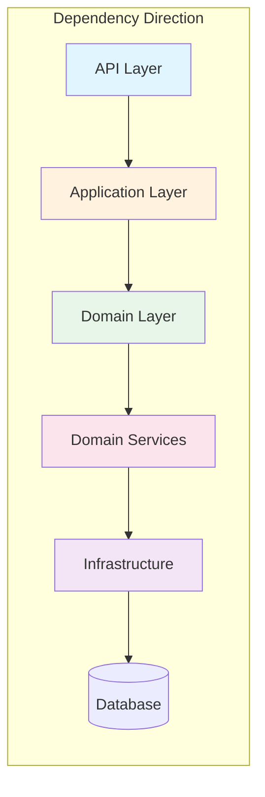

**Key Principles:**
1. **Domain Layer** has no external dependencies
2. **Application Layer** depends only on Domain and Domain Services
3. **Infrastructure** implements interfaces defined in Domain Services
4. **API Layer** wires everything together via Dependency Injection

---

## 4. Gateway Architecture

### 4.1 Gateway Component Diagram

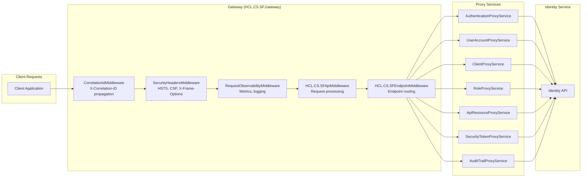

### 4.2 Gateway Middleware Pipeline

**Source:** `/src/Gateway/HCL.CS.SF.Gateway/Hosting/`

| Middleware | Purpose | Order |
|------------|---------|-------|
| **CorrelationIdMiddleware** | Generate/propagate correlation IDs | 1 (First) |
| **SecurityHeadersMiddleware** | Add security response headers | 2 |
| **RequestObservabilityMiddleware** | Metrics collection, request logging | 3 |
| **HCL.CS.SFApiMiddleware** | API request processing | 4 |
| **HCL.CS.SFEndpointMiddleware** | Endpoint-specific routing | 5 (Last) |

### 4.3 Proxy Services

**Source:** `/src/Gateway/HCL.CS.SF.Gateway/Proxy/`

| Service | Responsibility | Routes |
|---------|---------------|--------|
| `AuthenticationProxyService` | Authentication flows | `/api/auth/*` |
| `UserAccountProxyService` | User management | `/api/users/*` |
| `ClientProxyService` | OAuth client management | `/api/clients/*` |
| `RoleProxyService` | Role management | `/api/roles/*` |
| `ApiResourceProxyService` | API resource management | `/api/resources/*` |
| `SecurityTokenProxyService` | Token operations | `/api/tokens/*` |
| `AuditTrailProxyService` | Audit log queries | `/api/audit/*` |
| `IdentityResourceProxyService` | Identity resource management | `/api/identity-resources/*` |

### 4.4 Security Headers Applied

**Source:** `/src/Gateway/HCL.CS.SF.Gateway/Hosting/SecurityHeadersMiddleware.cs`

| Header | Value | Purpose |
|--------|-------|---------|
| X-Frame-Options | DENY | Clickjacking protection |
| X-Content-Type-Options | nosniff | MIME sniffing protection |
| Referrer-Policy | strict-origin-when-cross-origin | Referrer control |
| Strict-Transport-Security | max-age=31536000; includeSubDomains | HSTS enforcement |
| Permissions-Policy | camera=(), microphone=(), geolocation=(), payment=() | Feature policy |
| Server | (removed) | Information disclosure reduction |

---

## 5. Installer Architecture

### 5.1 Installer Workflow

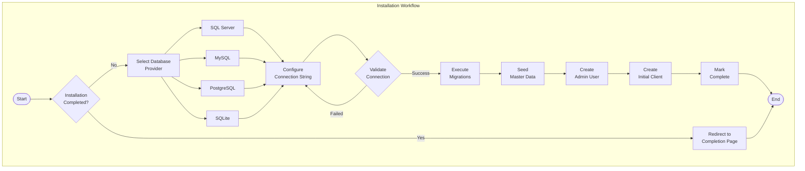

### 5.2 Installer Components

**Source:** `/installer/HCL.CS.SF.Installer.Mvc/`

| Component | Purpose | Key Files |
|-----------|---------|-----------|
| **SetupController** | MVC controller for installation wizard | `Controllers/SetupController.cs` |
| **InstallerService** | Orchestrates installation workflow | `Application/Services/InstallerService.cs` |
| **DatabaseProvisioner** | Provider-specific provisioning | `Infrastructure/Services/DatabaseProvisioning/*Provisioner.cs` |
| **DatabaseMigrationService** | EF Core migration execution | `Infrastructure/Services/DatabaseMigrationService.cs` |
| **SeedDataService** | Master data seeding | `Infrastructure/Services/SeedDataService.cs` |
| **SetupRedirectMiddleware** | Blocks access until installed | `Middleware/SetupRedirectMiddleware.cs` |
| **InstallationGateService** | Prevents re-installation | `Infrastructure/Services/InstallationGateService.cs` |

### 5.3 Provider Provisioners

| Provider | Provisioner Class | Responsibilities |
|----------|------------------|------------------|
| SQL Server | `SqlServerProvisioner` | Create database, validate connection |
| MySQL | `MySqlProvisioner` | Create database, validate connection |
| PostgreSQL | `PostgreSqlProvisioner` | Create database, validate connection |
| SQLite | `SqliteProvisioner` | Ensure directory exists, validate path |

---

## 6. Communication Patterns

### 6.1 Gateway to Identity Service

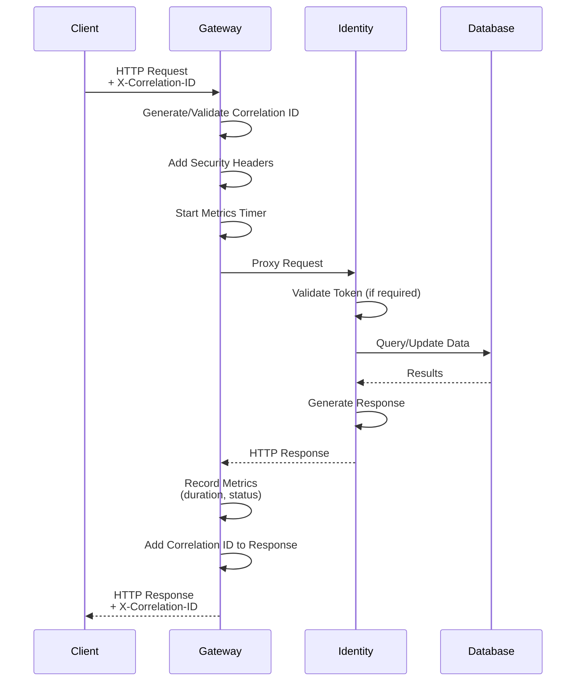

### 6.2 OAuth Authorization Code Flow

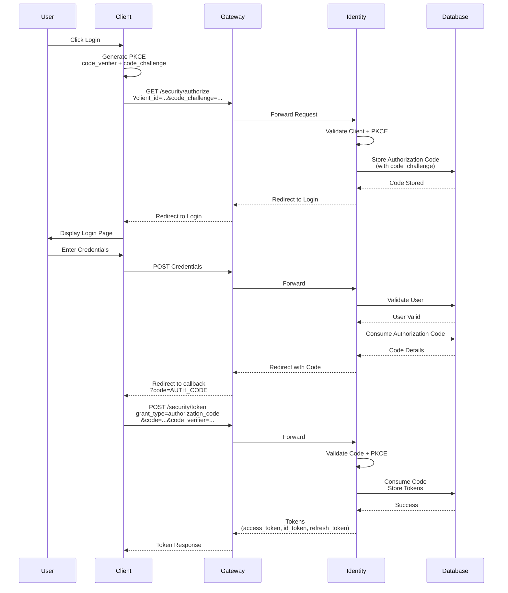

### 6.3 Inter-Layer Communication

| Pattern | Usage | Example |
|---------|-------|---------|
| **Dependency Injection** | Cross-layer service resolution | `IServiceCollection` registration |
| **Repository Pattern** | Data access abstraction | `IUserRepository` → `UserRepository` |
| **Unit of Work** | Transaction boundaries | `IUserManagementUnitOfWork.SaveChangesAsync()` |
| **Specification Pattern** | Validation rules | `AuthorizeRequestSpecification` |
| **Result Pattern** | Operation outcomes | `FrameworkResult<T>` |

---

## 7. Deployment Shapes

### 7.1 Local Development

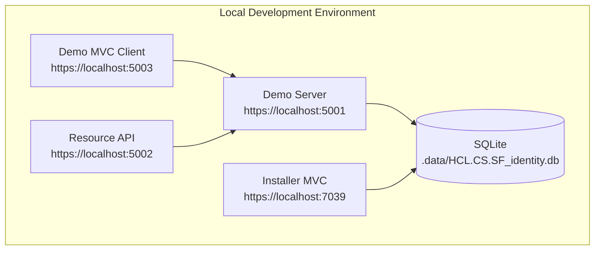

**Deployment Command:**
```bash
./scripts/run-local-demo.sh --client-id "..." --client-secret "..."
```

### 7.2 Docker Compose

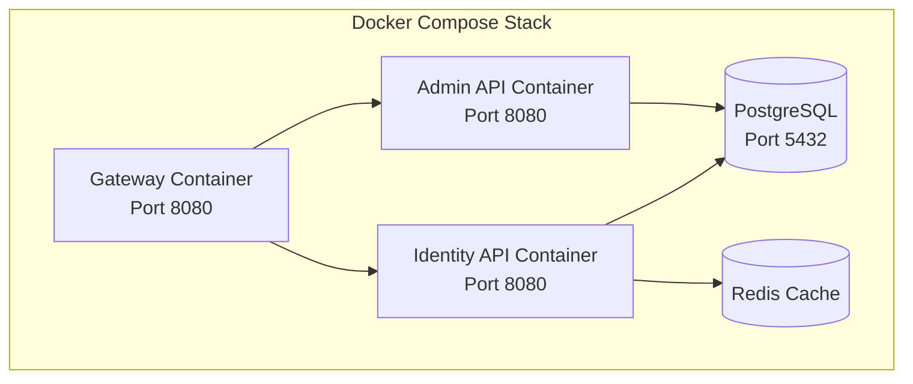

**Configuration:**
- Compose file: `/docker/docker-compose.yml`
- Identity Dockerfile: `/docker/identity-api.Dockerfile`
- Admin Dockerfile: `/docker/admin-api.Dockerfile`
- Gateway Dockerfile: `/docker/gateway.Dockerfile`

### 7.3 Kubernetes

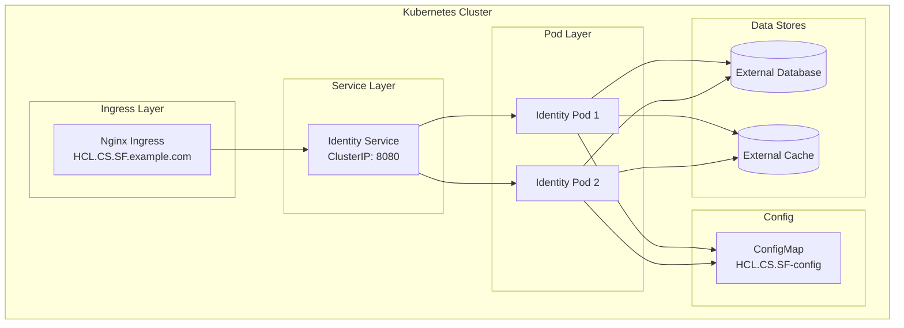

**Manifests:**
- ConfigMap: `/k8s/configmap.yaml`
- Deployment: `/k8s/identity-deployment.yaml`
- Service: `/k8s/identity-service.yaml`
- Ingress: `/k8s/ingress.yaml`

**Deployment Commands:**
```bash
kubectl apply -f k8s/configmap.yaml
kubectl apply -f k8s/identity-deployment.yaml
kubectl apply -f k8s/identity-service.yaml
kubectl apply -f k8s/ingress.yaml
```

### 7.4 Deployment Comparison

| Aspect | Local | Docker Compose | Kubernetes |
|--------|-------|----------------|------------|
| **Use Case** | Development | Testing / Small prod | Production |
| **Database** | SQLite (default) | Containerized PostgreSQL | External managed DB |
| **Cache** | In-memory | Containerized Redis | External managed Redis |
| **Scaling** | Single instance | Single instance | Horizontal pod autoscaling |
| **SSL** | Development certs | Development certs | Ingress TLS termination |
| **Monitoring** | Console logs | Container logs | Prometheus/Grafana integration |

---

## 8. Key Architectural Decisions

### 8.1 ADR Summary

| Decision | Rationale | Trade-off |
|----------|-----------|-----------|
| **Clean Architecture** | Separation of concerns, testability | More boilerplate, learning curve |
| **Custom OAuth Implementation** | Full control over security, no external dependencies | Development effort, maintenance burden |
| **EF Core with Multiple Providers** | Flexibility for different deployment scenarios | Provider-specific code needed |
| **Gateway as Library** | Can be embedded or standalone | Less separation than separate process |
| **PKCE Mandatory** | Security best practice for all clients | Breaks legacy clients without PKCE |
| **Implicit Flow Disabled** | Security (token exposure in URL) | Requires PKCE implementation in clients |

### 8.2 Source File Inventory

This architecture is grounded in the following source files:

| Layer | Path |
|-------|------|
| API | `/src/Identity/HCL.CS.SF.Identity.API/Program.cs` |
| Application | `/src/Identity/HCL.CS.SF.Identity.Application/Implementation/` |
| Domain | `/src/Identity/HCL.CS.SF.Identity.Domain/Entities/`, `/src/Identity/HCL.CS.SF.Identity.Domain/Models/` |
| Domain Services | `/src/Identity/HCL.CS.SF.Identity.DomainServices/` |
| Infrastructure | `/src/Identity/HCL.CS.SF.Identity.Infrastructure/`, `/src/Identity/HCL.CS.SF.Identity.Infrastructure.Resources/` |
| Persistence | `/src/Identity/HCL.CS.SF.Identity.Persistence/` |
| Gateway | `/src/Gateway/HCL.CS.SF.Gateway/` |
| Installer | `/installer/HCL.CS.SF.Installer.Mvc/` |

---

## Version History

| Version | Date | Author | Changes |
|---------|------|--------|---------|
| 1.0.0 | 2026-03-01 | Enterprise Documentation Team | Initial release |
