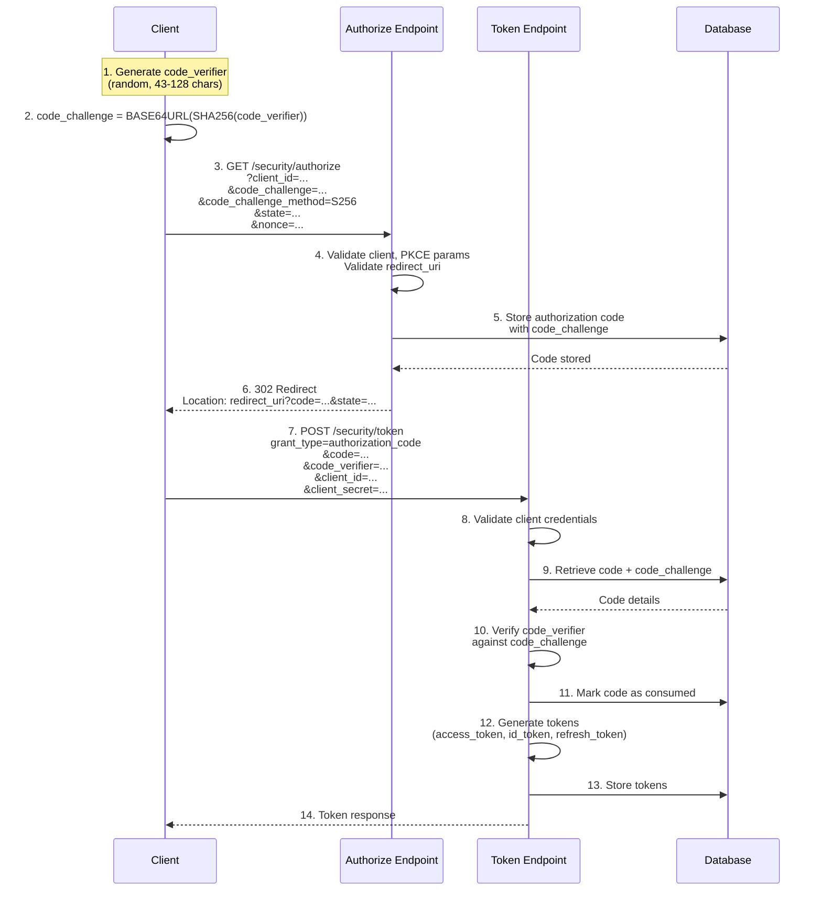
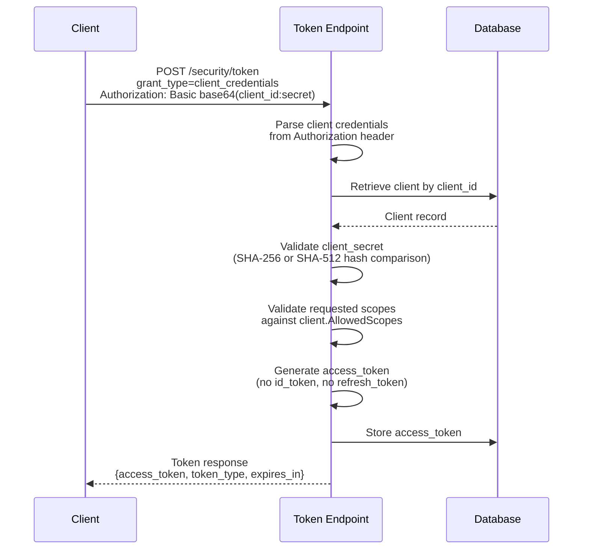
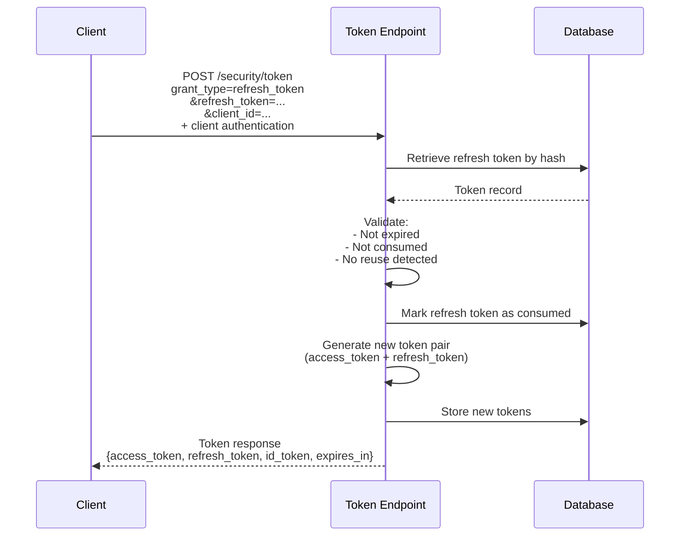
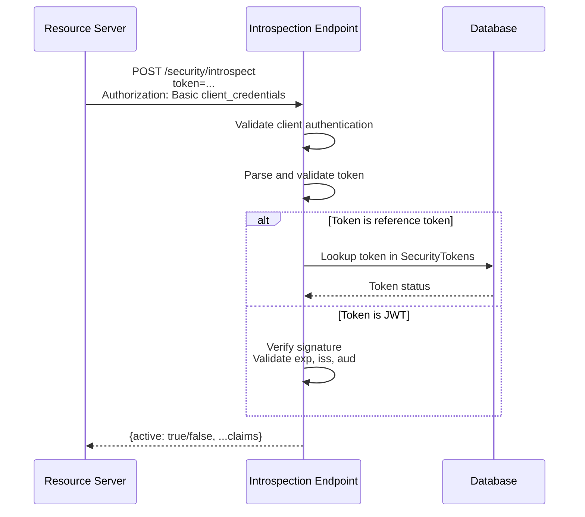
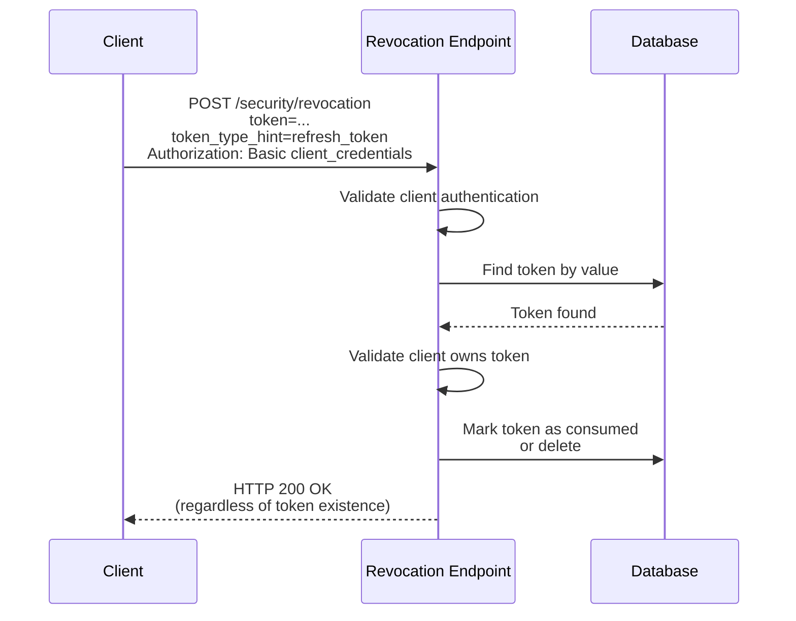
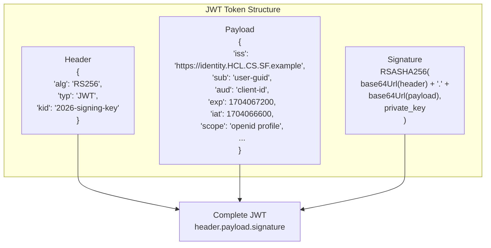
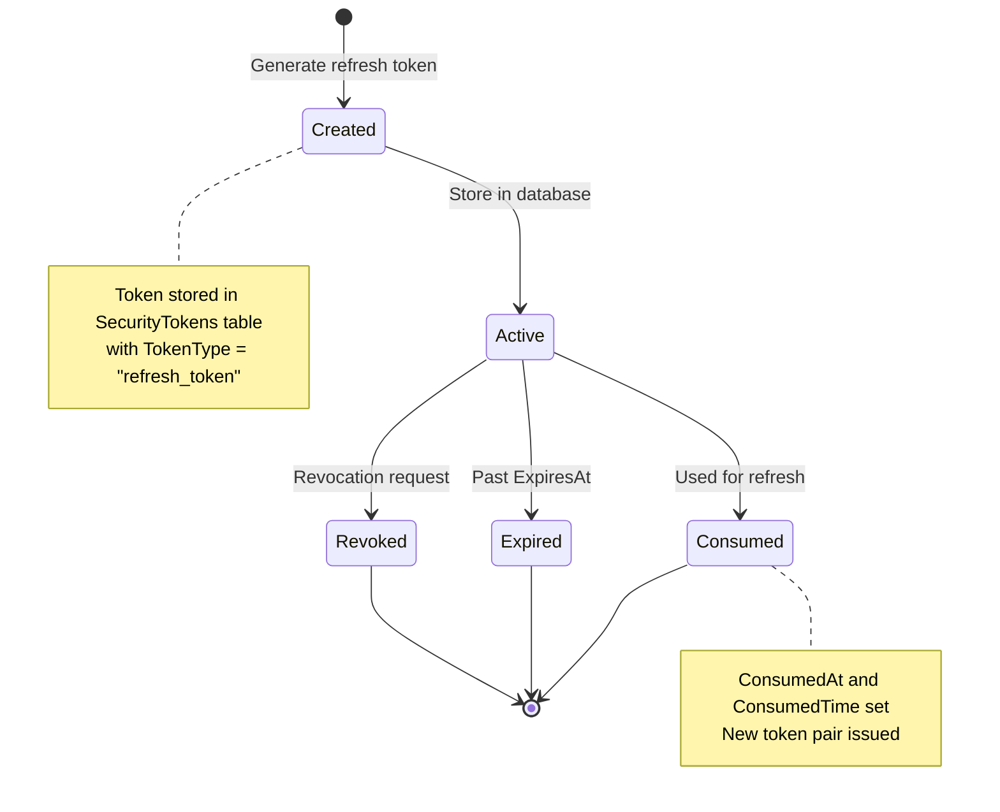
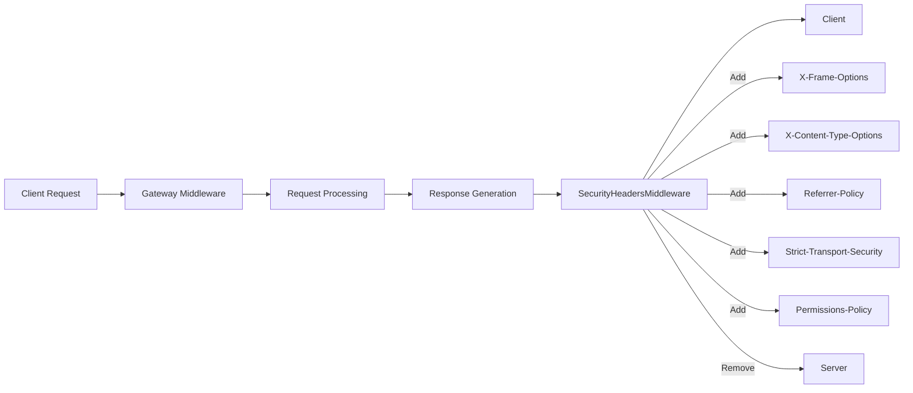
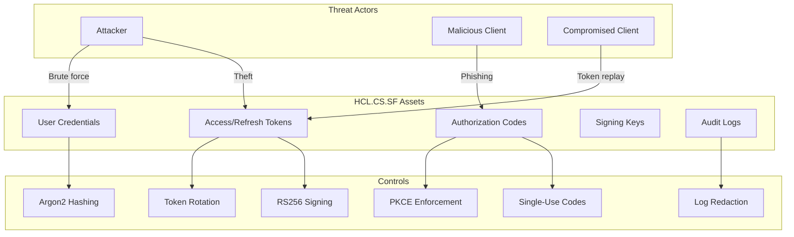

# HCL.CS.SF Security Architecture

**Document ID:** HCL.CS.SF-DOC-03-SECURITY-ARCHITECTURE  
**Version:** 1.0.0  
**Classification:** Internal Use - Security Sensitive  
**Last Updated:** 2026-03-01  

---

## Table of Contents

1. [Authentication Flows](#1-authentication-flows)
2. [JWT Lifecycle](#2-jwt-lifecycle)
3. [Refresh Token Handling](#3-refresh-token-handling)
4. [Data Protection Keys](#4-data-protection-keys)
5. [Security Headers Middleware](#5-security-headers-middleware)
6. [Logging Redaction](#6-logging-redaction)
7. [Certificate Usage](#7-certificate-usage)
8. [OWASP Mapping](#8-owasp-mapping)
9. [Threat Model Summary](#9-threat-model-summary)

---

## 1. Authentication Flows

### 1.1 Supported OAuth 2.0 / OIDC Flows

| Flow | Status | Implementation Evidence |
|------|--------|------------------------|
| Authorization Code + PKCE | ✅ Primary | `AuthorizeCodeFlowSpecification.cs` |
| Client Credentials | ✅ Supported | `ClientCredentialsFlowSpecification.cs` |
| Refresh Token | ✅ Supported | `RefreshTokenFlowSpecification.cs` |
| Resource Owner Password | ⚠️ Supported (deprecated) | `ResourceOwnerFlowSpecification.cs` |
| Token Introspection | ✅ Supported | `IntrospectionEndpoint.cs` |
| Token Revocation | ✅ Supported | `TokenRevocationEndpoint.cs` |
| UserInfo | ✅ Supported | `UserInfoEndpoint.cs` |
| End Session | ✅ Supported | `EndSessionEndpoint.cs`, `EndSessionCallbackEndpoint.cs` |
| Discovery | ✅ Supported | `DiscoveryEndpoint.cs` |
| JWKS | ✅ Supported | `JwksEndpoint.cs` |

### 1.2 Authorization Code + PKCE Flow



### 1.3 Client Credentials Flow

**Use Case:** Server-to-server authentication without user context.



### 1.4 Refresh Token Flow



### 1.5 Token Introspection Flow

**Endpoint:** `POST /security/introspect`

**Purpose:** Verify access token validity and retrieve claims.



### 1.6 Token Revocation Flow

**Endpoint:** `POST /security/revocation`

**Purpose:** Revoke access or refresh token.



---

## 2. JWT Lifecycle

### 2.1 JWT Structure



### 2.2 Token Types and Claims

| Token Type | Claims | Expiration | Storage |
|------------|--------|------------|---------|
| **Access Token** | iss, sub, aud, exp, iat, scope, client_id | Configurable (default: 300s) | JWT (self-contained) |
| **ID Token** | iss, sub, aud, exp, iat, nonce, auth_time, at_hash | Configurable (default: 300s) | JWT (self-contained) |
| **Refresh Token** | Key (reference), ExpiresAt | Configurable (default: 86400s) | Database (SecurityTokens) |
| **Authorization Code** | Key (reference), CodeChallenge | Configurable (default: 300s) | Database (SecurityTokens) |

### 2.3 Token Generation Service

**Source:** `/src/Identity/HCL.CS.SF.Identity.Application/Implementation/Endpoint/Services/TokenGenerationService.cs`

```csharp
// Token generation flow
public async Task<TokenResponseModel> ProcessTokenAsync(ValidatedTokenRequestModel request)
{
    // 1. Determine token type (access, id, refresh)
    // 2. Build claims list based on scopes and user
    // 3. Sign JWT with configured algorithm (RS256/ES256)
    // 4. Store reference tokens in database
    // 5. Return token response
}
```

### 2.4 Signing Algorithms

**Source:** `/src/Identity/HCL.CS.SF.Identity.Domain/Constants/Endpoint/OpenIdConstants.cs`

| Algorithm | Constant | Status | Key Type |
|-----------|----------|--------|----------|
| RS256 | `Algorithms.RsaSha256` | ✅ Primary | RSA |
| RS384 | `Algorithms.RsaSha384` | ⚠️ Supported | RSA |
| RS512 | `Algorithms.RsaSha512` | ⚠️ Supported | RSA |
| ES256 | `Algorithms.EcdsaSha256` | ✅ Supported | ECDSA |
| ES384 | `Algorithms.EcdsaSha384` | ⚠️ Supported | ECDSA |
| ES512 | `Algorithms.EcdsaSha512` | ⚠️ Supported | ECDSA |
| HS256 | `Algorithms.HmacSha256` | ⚠️ Deprecated | Symmetric |
| none | N/A | ❌ Prohibited | - |

### 2.5 Token Validation

**Source:** `/src/Identity/HCL.CS.SF.Identity.Application/Implementation/Endpoint/Extensions/TokenExtension.cs`

```csharp
// Token validation parameters
var validationParameters = new TokenValidationParameters
{
    ValidateIssuer = true,
    ValidIssuer = tokenConfig.IssuerUri,
    ValidateAudience = true,
    ValidateLifetime = true,
    LifetimeValidator = CustomLifetimeValidator,
    ValidateIssuerSigningKey = true,
    IssuerSigningKeyResolver = GetSigningKey
};
```

---

## 3. Refresh Token Handling

### 3.1 Refresh Token Lifecycle



### 3.2 Refresh Token Rotation

**Source:** `/src/Identity/HCL.CS.SF.Identity.Application/Implementation/Endpoint/Services/TokenGenerationService.cs`

```csharp
// Refresh token rotation logic
if (refreshTokenEntity.TokenReuseDetected || 
    refreshTokenEntity.ConsumedAt.HasValue || 
    refreshTokenEntity.ConsumedTime.HasValue)
{
    // Reuse detected - invalidate entire token family
    await HandleRefreshTokenReuseAsync(refreshTokenEntity);
    return Failed(EndpointErrorCodes.TokenIsNullOrInvalid);
}

// Consume old token
await tokenQuery.ExecuteUpdateAsync(setters => setters
    .SetProperty(x => x.ConsumedAt, consumedAt)
    .SetProperty(x => x.ConsumedTime, consumedAt));

// Generate new refresh token
var nextRefreshTokenHandle = cryptoConfig.RandomStringLength.RandomString();
// Store new token, return to client
```

### 3.3 Security Tokens Entity

**Source:** `/src/Identity/HCL.CS.SF.Identity.Domain/Entities/Endpoint/SecurityTokens.cs`

```csharp
public class SecurityTokens : BaseEntity
{
    public virtual string Key { get; set; }              // Token handle/hash
    public virtual string TokenType { get; set; }        // "refresh_token", "authorization_code"
    public virtual string TokenValue { get; set; }       // Serialized token data
    public virtual string ClientId { get; set; }         // Associated client
    public virtual string SessionId { get; set; }        // Session identifier
    public virtual string SubjectId { get; set; }        // User identifier
    public virtual DateTime CreationTime { get; set; }
    public virtual int ExpiresAt { get; set; }           // Unix timestamp
    public virtual DateTime? ConsumedTime { get; set; }  // When consumed
    public virtual DateTime? ConsumedAt { get; set; }
    public virtual bool TokenReuseDetected { get; set; } // Reuse detection flag
}
```

### 3.4 Token Reuse Detection

| Scenario | Action | Log Entry |
|----------|--------|-----------|
| Normal use | Issue new tokens, consume old | Info: Token refreshed |
| Reuse detected | Invalidate token family | Warning: Token reuse detected |
| Expired token | Reject, no new tokens | Info: Token expired |
| Wrong client | Reject, log security event | Warning: Client mismatch |

---

## 4. Data Protection Keys

### 4.1 Key Storage in Demo Environment

**Location:** `App_Data/keys` (development/demo environments)

```mermaid
flowchart TB
    subgraph "Key Storage"
        DP[DataProtectionProvider]
        KEYS[App_Data/keys/]
        
        subgraph "Key Files"
            KEY1[key-{guid}.xml]
            KEY2[key-{guid}.xml]
            REV[revisions.xml]
        end
    end
    
    DP --> KEYS
    KEYS --> KEY1
    KEYS --> KEY2
    KEYS --> REV
```

### 4.2 Key Configuration

**Source:** `/src/Identity/HCL.CS.SF.Identity.Application/Implementation/Endpoint/Extensions/DataProtectionExtension.cs`

```csharp
// Data protection configuration
services.AddDataProtection()
    .PersistKeysToFileSystem(keyDirectory)
    .SetApplicationName("HCL.CS.SF")
    .SetDefaultKeyLifetime(TimeSpan.FromDays(90));
```

### 4.3 Production Key Management

| Environment | Key Storage | Recommendation |
|-------------|-------------|----------------|
| Development | App_Data/keys | Acceptable for local dev |
| Staging | Azure Key Vault / AWS KMS | Cloud key management |
| Production | HSM / Cloud KMS | Hardware security module |

### 4.4 Key Rotation

- Keys automatically rotate after 90 days (configurable)
- New keys used for encryption
- Old keys retained for decryption
- Maximum key lifetime: 180 days

---

## 5. Security Headers Middleware

### 5.1 Headers Applied

**Source:** `/src/Gateway/HCL.CS.SF.Gateway/Hosting/SecurityHeadersMiddleware.cs`

| Header | Value | Security Purpose | RFC/Standard |
|--------|-------|------------------|--------------|
| X-Frame-Options | DENY | Clickjacking protection | RFC 7034 |
| X-Content-Type-Options | nosniff | MIME sniffing prevention | - |
| Referrer-Policy | strict-origin-when-cross-origin | Referrer leakage prevention | W3C |
| Strict-Transport-Security | max-age=31536000; includeSubDomains | HTTPS enforcement | RFC 6797 |
| Permissions-Policy | camera=(), microphone=(), geolocation=(), payment=() | Feature restrictions | W3C |
| Server | (removed) | Information disclosure reduction | - |

### 5.2 HSTS Configuration

```csharp
// HSTS only set over HTTPS to avoid spec violation
if (context.Request.IsHttps && !headers.ContainsKey("Strict-Transport-Security"))
{
    headers["Strict-Transport-Security"] = "max-age=31536000; includeSubDomains";
}
```

### 5.3 Header Injection Points



---

## 6. Logging Redaction

### 6.1 Sensitive Fields

**Source:** `/src/Gateway/HCL.CS.SF.Gateway/Hosting/LogRedactionHelper.cs`

```csharp
private static readonly HashSet<string> SensitiveFields = new(StringComparer.OrdinalIgnoreCase)
{
    "password",
    "secret",
    "token",
    "authorization",
    "cookie",
    "apikey",
    "api_key",
    "email",
    "phone",
    "ssn"
};
```

### 6.2 Redaction Behavior

| Input Type | Example Input | Redacted Output |
|------------|---------------|-----------------|
| Password field | `password=MySecret123` | `password=[REDACTED]` |
| Token header | `Authorization: Bearer eyJ...` | `Authorization=[REDACTED]` |
| Email field | `email=user@example.com` | `email=[REDACTED]` |
| Normal field | `username=john.doe` | `username=john.doe` (unchanged) |

### 6.3 User ID Redaction

```csharp
// Safe user ID validation
internal static string GetSafeUserId(string? userId)
{
    if (string.IsNullOrWhiteSpace(userId)) return "anonymous";
    
    var trimmed = userId.Trim();
    if (trimmed.Length > 64) return RedactedValue;
    if (trimmed.Contains('@')) return RedactedValue;  // Looks like email
    if (trimmed.Any(char.IsWhiteSpace)) return RedactedValue;
    if (PhoneLikeRegex().IsMatch(trimmed)) return RedactedValue;
    
    return trimmed;
}
```

### 6.4 Log Redaction in Observability

**Source:** `/src/Gateway/HCL.CS.SF.Gateway/Hosting/RequestObservabilityMiddleware.cs`

```csharp
// Redacted logging in request processing
logger.LogInformation(
    "Request processed: {Method} {Route} - Status: {StatusCode} - User: {UserId}",
    method,
    route,
    statusCode,
    LogRedactionHelper.GetSafeUserId(userId)
);
```

---

## 7. Certificate Usage

### 7.1 Certificate Locations

| Purpose | Location | Format |
|---------|----------|--------|
| Signing Keys | Configured via `TokenConfig` | RSA/ECDSA private keys |
| HTTPS (Dev) | `appsettings.Development.json` | Development certificate |
| HTTPS (Prod) | Certificate store / Key Vault | X.509 |

### 7.2 JWT Signing Keys

**Source:** `/src/Identity/HCL.CS.SF.Identity.Application/Implementation/Endpoint/Services/JWKSService.cs`

```csharp
// JWKS endpoint - exposes public keys
public async Task<List<JsonWebKeyResponseModel>> ProcessJWKSInformations()
{
    // Retrieve signing keys from key store
    // Return public key components only
    // Never expose private keys
}
```

### 7.3 Key Types Supported

| Key Type | Algorithm | Usage |
|----------|-----------|-------|
| RSA-2048 | RS256, RS384, RS512 | Primary signing |
| RSA-3072 | RS256, RS384, RS512 | High security |
| ECDSA P-256 | ES256 | Alternative |
| ECDSA P-384 | ES384 | Alternative |

### 7.4 Test Certificates

**Location:** `/tests/` (if present)

Test certificates are used for integration testing only and must never be used in production.

---

## 8. OWASP Mapping

### 8.1 OWASP Top 10 2021 Mitigations

| OWASP Risk | HCL.CS.SF Control | Implementation |
|------------|----------------|----------------|
| **A01: Broken Access Control** | Strict scope validation, client binding | `ResourceScopeValidator.cs` |
| **A02: Cryptographic Failures** | Argon2 password hashing, RSA-256 signing | `Argon2PasswordHasherWrapper.cs`, `TokenGenerationService.cs` |
| **A03: Injection** | Input length restrictions, parameterized queries | `InputLengthRestrictionsConfig.cs`, EF Core |
| **A04: Insecure Design** | PKCE enforcement, token rotation | `ProofKeyParametersSpecification.cs` |
| **A05: Security Misconfiguration** | Secure defaults, security headers | `SecurityHeadersMiddleware.cs` |
| **A06: Vulnerable Components** | Dependency management via Directory.Packages.props | `Directory.Packages.props` |
| **A07: Auth Failures** | MFA, brute force protection, account lockout | User config in `HCL.CS.SFConfig` |
| **A08: Data Integrity Failures** | JWS signatures, at_hash validation | `TokenGenerationService.cs` |
| **A09: Logging Failures** | Structured logging, audit trails, redaction | `LogRedactionHelper.cs`, `AuditTrailService.cs` |
| **A10: SSRF** | URL validation in redirect URIs | `ClientRedirectUriComparer.cs` |

### 8.2 Detailed Control Mapping

#### A01: Broken Access Control

| Control | Implementation | Evidence |
|---------|---------------|----------|
| Strict redirect URI matching | Exact string comparison | `ClientRedirectUriComparer.cs` |
| Scope validation | AllowedScopes checked per client | `ResourceScopeValidator.cs` |
| Client binding | Tokens bound to issuing client | `TokenGenerationService.cs` |
| No wildcard URIs | Prohibited by validation | `CheckClientRedirectUri` spec |

#### A02: Cryptographic Failures

| Control | Implementation | Evidence |
|---------|---------------|----------|
| Password hashing | Argon2id | `Argon2PasswordHasherWrapper.cs` |
| Client secret hashing | SHA-256/SHA-512 | `SecretValidator.cs` |
| JWT signing | RS256/ES256 | `TokenGenerationService.cs` |
| Key protection | Data Protection API | `DataProtectionExtension.cs` |

#### A07: Authentication Failures

| Control | Implementation | Configuration |
|---------|---------------|---------------|
| Account lockout | Failed attempt tracking | `UserConfig.MaxFailedAccessAttempts` |
| MFA support | Email, SMS, Authenticator | `TwoFactorType` enum |
| Password policy | Complexity requirements | `PasswordConfig` |
| Password history | Reuse prevention | `PasswordHistory` entity |

---

## 9. Threat Model Summary

### 9.1 Primary Assets

**Source:** `/docs/THREAT_MODEL.md`

| Asset | Value | Protection Priority |
|-------|-------|---------------------|
| User credentials | High | Critical |
| Access tokens | High | Critical |
| Refresh tokens | Critical | Critical |
| Client secrets | Critical | Critical |
| Signing keys | Critical | Critical |
| Audit records | High | High |

### 9.2 Threat Categories

| Category | Threats | Controls |
|----------|---------|----------|
| **Credential Theft** | Phishing, keyloggers, brute force | MFA, account lockout, password policy |
| **Token Theft** | Network sniffing, XSS, local storage theft | Short token lifetimes, HTTPS, HttpOnly cookies |
| **Token Forgery** | Key compromise, algorithm confusion | RS256 signing, key rotation, algorithm whitelist |
| **Authorization Code Interception** | Malicious app registration, phishing | PKCE mandatory, exact redirect URI matching |
| **Replay Attacks** | Token reuse, code reuse | Single-use codes, token consumption tracking |
| **Privilege Escalation** | Scope manipulation, client impersonation | Scope validation, client binding, strict typing |

### 9.3 Code Enforcement Points

| Threat | Enforcement Point | File |
|--------|------------------|------|
| Authorization code replay | Consumption check | `AuthorizationService.cs` |
| Refresh token replay | Reuse detection | `TokenGenerationService.cs` |
| Invalid redirect URI | Exact match validation | `ClientRedirectUriComparer.cs` |
| Missing PKCE | PKCE specification | `ProofKeyParametersSpecification.cs` |
| Expired tokens | Lifetime validation | `TokenExtension.cs` |
| Invalid signatures | JWT validation | `TokenGenerationService.cs` |

### 9.4 Threat Model Diagram



### 9.5 Compliance Mapping

| Framework | Requirement | HCL.CS.SF Implementation |
|-----------|-------------|----------------------|
| **SOC 2 CC6.1** | Logical access controls | Role-based access, client authentication |
| **SOC 2 CC6.2** | Authentication mechanisms | MFA, password policies, session management |
| **ISO 27001 A.9.4.2** | Secure log-on | OAuth 2.0 flows, PKCE |
| **ISO 27001 A.12.3.1** | Backup | Database backup procedures |
| **NIST 800-63B** | Digital identity | Authenticator assurance levels |

---

## 10. Security Checklist

### 10.1 Pre-Deployment Security Checklist

| # | Check | Status |
|---|-------|--------|
| 1 | HTTPS enforced in production | ☐ |
| 2 | Strong signing keys configured (RSA-2048+) | ☐ |
| 3 | Data protection keys secured (not in App_Data) | ☐ |
| 4 | Client secrets use strong hashing (SHA-512) | ☐ |
| 5 | Password policy meets organizational requirements | ☐ |
| 6 | MFA enabled for admin accounts | ☐ |
| 7 | Audit logging enabled | ☐ |
| 8 | Log redaction configured | ☐ |
| 9 | Security headers enabled | ☐ |
| 10 | Token lifetimes configured appropriately | ☐ |

### 10.2 Security Monitoring

| Event | Log Level | Response |
|-------|-----------|----------|
| Token reuse detected | Warning | Alert security team |
| Multiple failed logins | Warning | Account lockout, alert |
| Invalid client authentication | Info | Rate limit, monitor |
| PKCE validation failure | Warning | Alert if pattern detected |
| Expired token usage | Info | Standard rejection |

---

## Version History

| Version | Date | Author | Changes |
|---------|------|--------|---------|
| 1.0.0 | 2026-03-01 | Enterprise Documentation Team | Initial release |
