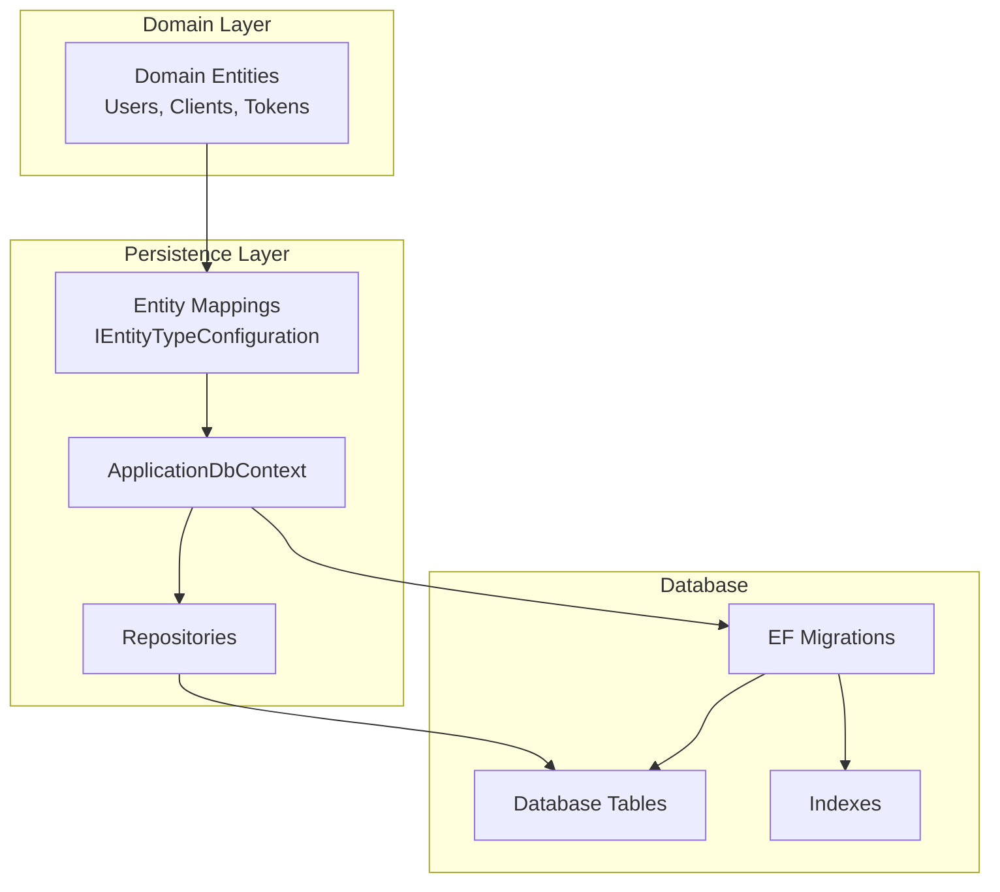
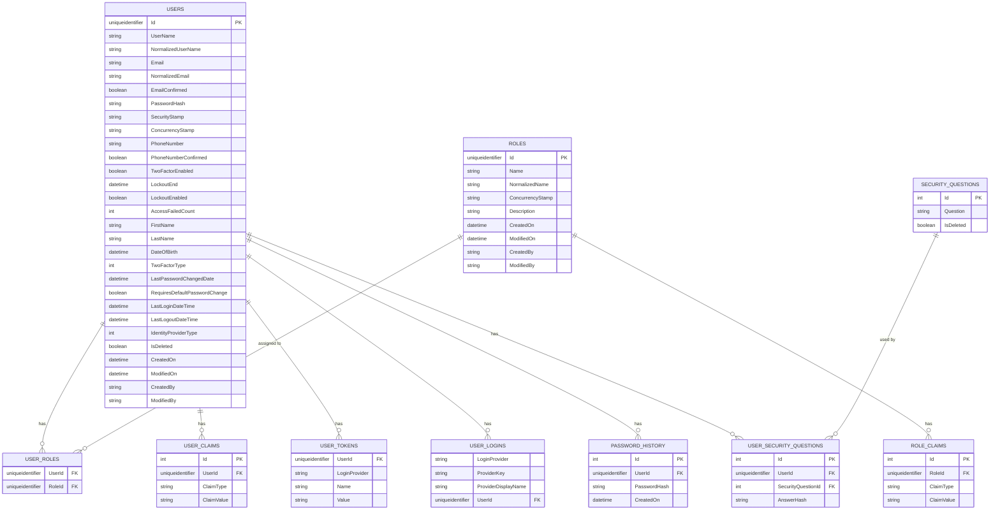
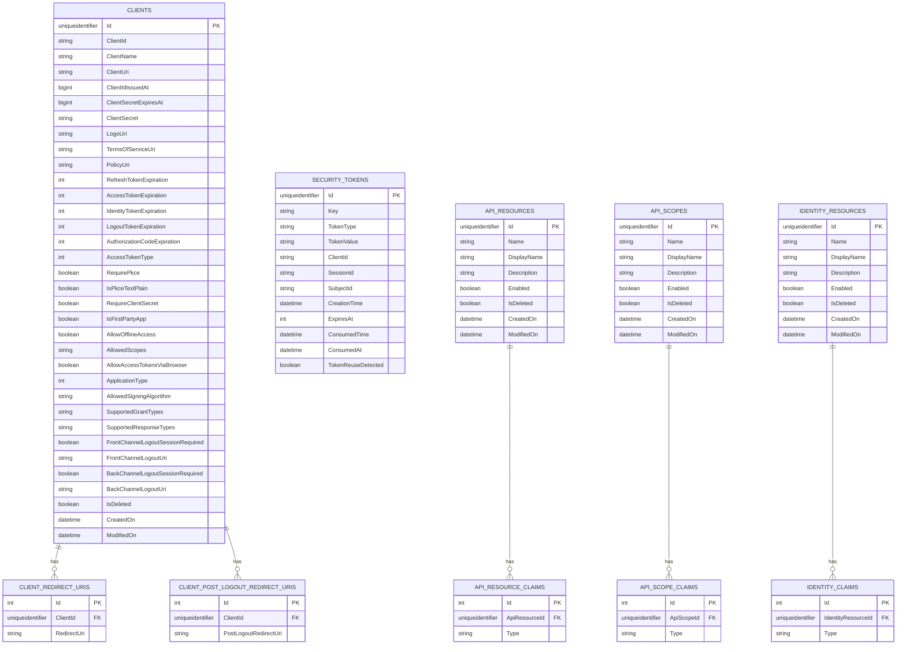
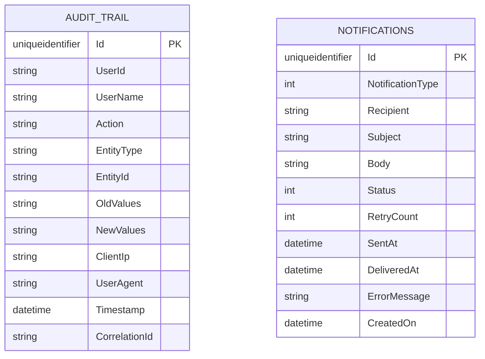
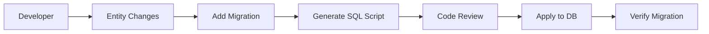

# HCL.CS.SF Database Documentation

**Document ID:** HCL.CS.SF-DOC-05-DATABASE  
**Version:** 1.0.0  
**Classification:** Internal Use  
**Last Updated:** 2026-03-01  

---

## Table of Contents

1. [Supported Database Engines](#1-supported-database-engines)
2. [Schema Strategy](#2-schema-strategy)
3. [Entity Relationship Diagram](#3-entity-relationship-diagram)
4. [Key Tables](#4-key-tables)
5. [Indexes](#5-indexes)
6. [Migration Strategy](#6-migration-strategy)
7. [Backup and Restore](#7-backup-and-restore)

---

## 1. Supported Database Engines

### 1.1 Database Provider Matrix

**Source:** `/installer/HCL.CS.SF.Installer.Mvc/Application/DTOs/DatabaseProviderType.cs`

| Provider | Enum Value | EF Core Provider | Status | Provider Class |
|----------|------------|------------------|--------|----------------|
| **Microsoft SQL Server** | `SqlServer = 1` | Microsoft.EntityFrameworkCore.SqlServer | ✅ Supported | `SqlServerProvisioner.cs` |
| **MySQL** | `MySql = 2` | Pomelo.EntityFrameworkCore.MySql | ✅ Supported | `MySqlProvisioner.cs` |
| **PostgreSQL** | `PostgreSql = 3` | Npgsql.EntityFrameworkCore.PostgreSQL | ✅ Supported | `PostgreSqlProvisioner.cs` |
| **SQLite** | `Sqlite = 4` | Microsoft.EntityFrameworkCore.Sqlite | ✅ Supported | `SqliteProvisioner.cs` |

### 1.2 Provider-Specific Implementations

**Source:** `/installer/HCL.CS.SF.Installer.Mvc/Infrastructure/Persistence/Data/`

| Provider | DbContext Class | Migration Path |
|----------|-----------------|----------------|
| SQL Server | `SqlServerApplicationDbContext` | `Migrations/Sql/` |
| MySQL | `MySqlApplicationDbContext` | `Migrations/MySql/` |
| PostgreSQL | `PostgreSqlApplicationDbcontext` | `Migrations/PostgreSql/` |
| SQLite | `SqLiteApplicationDbContext` | `Migrations/Sqlite/` |

### 1.3 Provider Capabilities

| Feature | SQL Server | MySQL | PostgreSQL | SQLite |
|---------|------------|-------|------------|--------|
| Transactions | ✅ Full | ✅ Full | ✅ Full | ✅ Limited |
| Row-level security | ✅ Yes | ⚠️ Limited | ✅ Yes | ❌ No |
| JSON columns | ✅ Yes | ✅ Yes | ✅ Native | ❌ No |
| Full-text search | ✅ Yes | ✅ Yes | ✅ Yes | ❌ No |
| Concurrent writes | ✅ Yes | ✅ Yes | ✅ Yes | ⚠️ Limited |
| Production recommended | ✅ Yes | ✅ Yes | ✅ Yes | ❌ Dev only |

### 1.4 Connection String Examples

```json
{
  "ConnectionStrings": {
    "SqlServer": "Server=localhost;Database=HCL.CS.SFIdentity;User Id=HCL.CS.SF;Password=***;Encrypt=True;TrustServerCertificate=False;",
    "MySql": "Server=localhost;Database=HCL.CS.SFIdentity;Uid=HCL.CS.SF;Pwd=***;SslMode=Required;",
    "PostgreSql": "Host=localhost;Database=HCL.CS.SFIdentity;Username=HCL.CS.SF;Password=***;SslMode=Require;",
    "Sqlite": "Data Source=/var/lib/HCL.CS.SF/identity.db;Mode=ReadWriteCreate;Cache=Shared;"
  }
}
```

---

## 2. Schema Strategy

### 2.1 Entity Framework Architecture



### 2.2 Schema Design Principles

| Principle | Implementation |
|-----------|---------------|
| **Soft Deletes** | `IsDeleted` flag on entities; filtered in queries |
| **Audit Trail** | `CreatedOn`, `ModifiedOn`, `CreatedBy`, `ModifiedBy` |
| **Optimistic Concurrency** | Row versioning where applicable |
| **Foreign Key Constraints** | Enforced at database level |
| **Indexing Strategy** | Query-optimized indexes on FKs and search fields |

### 2.3 DbContext Configuration

**Source:** `/src/Identity/HCL.CS.SF.Identity.Persistence/ApplicationDbContext.cs`

```csharp
public class ApplicationDbContext : IdentityDbContext<Users, Roles, Guid>
{
    // API Entities
    public DbSet<ApiResources> ApiResources { get; set; }
    public DbSet<ApiScopes> ApiScopes { get; set; }
    public DbSet<AuditTrail> AuditTrails { get; set; }
    public DbSet<Users> Users { get; set; }
    public DbSet<Roles> Roles { get; set; }
    
    // Endpoint Entities
    public DbSet<Clients> Clients { get; set; }
    public DbSet<SecurityTokens> SecurityTokens { get; set; }
    
    protected override void OnModelCreating(ModelBuilder builder)
    {
        base.OnModelCreating(builder);
        
        // Apply all entity configurations
        builder.ApplyConfigurationsFromAssembly(typeof(ApplicationDbContext).Assembly);
    }
}
```

### 2.4 Entity Mappings

**Source:** `/src/Identity/HCL.CS.SF.Identity.Persistence/Mapper/`

| Entity | Mapping File |
|--------|--------------|
| `Users` | `Api/UsersMap.cs` |
| `Roles` | `Api/RolesMap.cs` |
| `UserRoles` | `Api/UserRolesMap.cs` |
| `UserClaims` | `Api/UserClaimsMap.cs` |
| `RoleClaims` | `Api/RoleClaimsMap.cs` |
| `UserTokens` | `Api/UserTokensMap.cs` |
| `AuditTrail` | `Api/AuditTrailMap.cs` |
| `Clients` | `Endpoint/ClientsMap.cs` |
| `SecurityTokens` | `Endpoint/SecurityTokensMap.cs` |
| `ApiResources` | `Endpoint/ApiResourcesMap.cs` |
| `ApiScopes` | `Endpoint/ApiScopesMap.cs` |

---

## 3. Entity Relationship Diagram

### 3.1 Core Identity Entities



### 3.2 OAuth/OIDC Entities



### 3.3 Audit and System Entities



---

## 4. Key Tables

### 4.1 Users Table

**Purpose:** Core user identity storage (extends ASP.NET Core Identity).

**Source:** `/src/Identity/HCL.CS.SF.Identity.Domain/Entities/Api/Users.cs`

| Column | Type | Nullable | Description |
|--------|------|----------|-------------|
| `Id` | uniqueidentifier | No | Primary key (UUID) |
| `UserName` | nvarchar(256) | No | Unique username |
| `NormalizedUserName` | nvarchar(256) | No | Uppercase for case-insensitive lookup |
| `Email` | nvarchar(256) | Yes | Email address |
| `NormalizedEmail` | nvarchar(256) | Yes | Uppercase for case-insensitive lookup |
| `EmailConfirmed` | bit | No | Email verification status |
| `PasswordHash` | nvarchar(max) | Yes | Argon2 password hash |
| `SecurityStamp` | nvarchar(max) | Yes | Security stamp for invalidating sessions |
| `PhoneNumber` | nvarchar(max) | Yes | Phone number |
| `PhoneNumberConfirmed` | bit | No | Phone verification status |
| `TwoFactorEnabled` | bit | No | 2FA enabled flag |
| `LockoutEnd` | datetimeoffset | Yes | Lockout expiration |
| `LockoutEnabled` | bit | No | Lockout enabled flag |
| `AccessFailedCount` | int | No | Failed login attempts |
| `FirstName` | nvarchar(max) | Yes | User's first name |
| `LastName` | nvarchar(max) | Yes | User's last name |
| `DateOfBirth` | datetime2 | Yes | Date of birth |
| `TwoFactorType` | int | No | 0=None, 1=Email, 2=SMS, 3=Authenticator |
| `LastPasswordChangedDate` | datetime2 | Yes | Last password change |
| `RequiresDefaultPasswordChange` | bit | Yes | Force password change flag |
| `LastLoginDateTime` | datetime2 | Yes | Last successful login |
| `LastLogoutDateTime` | datetime2 | Yes | Last logout |
| `IdentityProviderType` | int | No | 0=Local, 1=LDAP |
| `IsDeleted` | bit | No | Soft delete flag |
| `CreatedOn` | datetime2 | No | Creation timestamp |
| `ModifiedOn` | datetime2 | Yes | Last modification timestamp |
| `CreatedBy` | nvarchar(max) | Yes | Creator identifier |
| `ModifiedBy` | nvarchar(max) | Yes | Last modifier identifier |

### 4.2 Clients Table

**Purpose:** OAuth 2.0 client application registration.

**Source:** `/src/Identity/HCL.CS.SF.Identity.Domain/Entities/Endpoint/Clients.cs`

| Column | Type | Nullable | Description |
|--------|------|----------|-------------|
| `Id` | uniqueidentifier | No | Primary key |
| `ClientId` | nvarchar(max) | No | Public client identifier |
| `ClientName` | nvarchar(max) | Yes | Human-readable name |
| `ClientUri` | nvarchar(max) | Yes | Client website URL |
| `ClientIdIssuedAt` | bigint | No | Unix timestamp of issuance |
| `ClientSecretExpiresAt` | bigint | No | Unix timestamp of secret expiration |
| `ClientSecret` | nvarchar(max) | Yes | SHA-256/SHA-512 hash of secret |
| `RefreshTokenExpiration` | int | No | Refresh token lifetime (seconds) |
| `AccessTokenExpiration` | int | No | Access token lifetime (seconds) |
| `IdentityTokenExpiration` | int | No | ID token lifetime (seconds) |
| `AuthorizationCodeExpiration` | int | No | Authorization code lifetime (seconds) |
| `RequirePkce` | bit | No | PKCE required flag |
| `RequireClientSecret` | bit | No | Confidential client flag |
| `AllowOfflineAccess` | bit | No | Refresh token grant allowed |
| `AllowedScopes` | nvarchar(max) | Yes | Space-delimited allowed scopes |
| `SupportedGrantTypes` | nvarchar(max) | Yes | Space-delimited grant types |
| `SupportedResponseTypes` | nvarchar(max) | Yes | Space-delimited response types |

### 4.3 SecurityTokens Table

**Purpose:** Storage for authorization codes, refresh tokens, and reference tokens.

**Source:** `/src/Identity/HCL.CS.SF.Identity.Domain/Entities/Endpoint/SecurityTokens.cs`

| Column | Type | Nullable | Description |
|--------|------|----------|-------------|
| `Id` | uniqueidentifier | No | Primary key |
| `Key` | nvarchar(max) | No | Token handle/reference |
| `TokenType` | nvarchar(max) | No | "refresh_token", "authorization_code", etc. |
| `TokenValue` | nvarchar(max) | Yes | Serialized token data |
| `ClientId` | nvarchar(max) | Yes | Associated client |
| `SessionId` | nvarchar(max) | Yes | Session identifier |
| `SubjectId` | nvarchar(max) | Yes | User identifier |
| `CreationTime` | datetime2 | No | Creation timestamp |
| `ExpiresAt` | int | No | Expiration Unix timestamp |
| `ConsumedTime` | datetime2 | Yes | When token was consumed |
| `ConsumedAt` | datetime2 | Yes | When token was consumed (redundant) |
| `TokenReuseDetected` | bit | No | Reuse detection flag |

### 4.4 AuditTrail Table

**Purpose:** Comprehensive audit logging.

**Source:** `/src/Identity/HCL.CS.SF.Identity.Domain/Entities/Api/AuditTrail.cs`

| Column | Type | Nullable | Description |
|--------|------|----------|-------------|
| `Id` | uniqueidentifier | No | Primary key |
| `UserId` | nvarchar(max) | Yes | Acting user ID |
| `UserName` | nvarchar(max) | Yes | Acting user name |
| `Action` | nvarchar(max) | Yes | Action performed |
| `EntityType` | nvarchar(max) | Yes | Affected entity type |
| `EntityId` | nvarchar(max) | Yes | Affected entity ID |
| `OldValues` | nvarchar(max) | Yes | JSON of previous values |
| `NewValues` | nvarchar(max) | Yes | JSON of new values |
| `ClientIp` | nvarchar(max) | Yes | Client IP address |
| `UserAgent` | nvarchar(max) | Yes | User agent string |
| `Timestamp` | datetime2 | No | When action occurred |
| `CorrelationId` | nvarchar(max) | Yes | Request correlation ID |

---

## 5. Indexes

### 5.1 Identity Indexes

**Source:** `/src/Identity/HCL.CS.SF.Identity.Persistence/Mapper/Api/`

| Table | Index | Columns | Purpose |
|-------|-------|---------|---------|
| Users | IX_Users_NormalizedUserName | `NormalizedUserName` | Username lookup |
| Users | IX_Users_NormalizedEmail | `NormalizedEmail` | Email lookup |
| Users | IX_Users_IsDeleted | `IsDeleted` | Soft delete filtering |
| UserRoles | IX_UserRoles_RoleId | `RoleId` | Role membership queries |
| UserClaims | IX_UserClaims_UserId | `UserId` | User claims lookup |
| RoleClaims | IX_RoleClaims_RoleId | `RoleId` | Role claims lookup |

### 5.2 OAuth Indexes

**Source:** `/src/Identity/HCL.CS.SF.Identity.Persistence/Mapper/Endpoint/`

| Table | Index | Columns | Purpose |
|-------|-------|---------|---------|
| Clients | IX_Clients_ClientId | `ClientId` | Client lookup |
| ClientRedirectUris | IX_ClientRedirectUris_ClientId | `ClientId` | Client URIs lookup |
| SecurityTokens | IX_SecurityTokens_Key | `Key` | Token lookup |
| SecurityTokens | IX_SecurityTokens_SubjectId | `SubjectId` | User token queries |
| SecurityTokens | IX_SecurityTokens_ConsumedAt | `ConsumedAt` | Cleanup queries |

### 5.3 Audit Indexes

| Table | Index | Columns | Purpose |
|-------|-------|---------|---------|
| AuditTrail | IX_AuditTrail_UserId | `UserId` | User activity queries |
| AuditTrail | IX_AuditTrail_EntityType_EntityId | `EntityType`, `EntityId` | Entity history |
| AuditTrail | IX_AuditTrail_Timestamp | `Timestamp` | Time-range queries |
| AuditTrail | IX_AuditTrail_CorrelationId | `CorrelationId` | Request tracing |

---

## 6. Migration Strategy

### 6.1 EF Core Migrations

**Source:** `/installer/HCL.CS.SF.Installer.Mvc/Infrastructure/Persistence/Migrations/`

| Provider | Migration Directory | Snapshot |
|----------|---------------------|----------|
| SQL Server | `Migrations/Sql/` | `SqlServerApplicationDbContextModelSnapshot.cs` |
| MySQL | `Migrations/MySql/` | `MySqlApplicationDbContextModelSnapshot.cs` |
| PostgreSQL | `Migrations/PostgreSql/` | `PostgreSqlApplicationDbcontextModelSnapshot.cs` |
| SQLite | `Migrations/Sqlite/` | `SqLiteApplicationDbContextModelSnapshot.cs` |

### 6.2 Migration Workflow



### 6.3 Creating Migrations

```bash
# SQL Server
dotnet ef migrations add MigrationName \
  --project src/Identity/HCL.CS.SF.Identity.Persistence \
  --startup-project src/Identity/HCL.CS.SF.Identity.API \
  --context SqlServerApplicationDbContext \
  --output-dir Migrations/Sql

# MySQL
dotnet ef migrations add MigrationName \
  --context MySqlApplicationDbContext \
  --output-dir Migrations/MySql

# PostgreSQL
dotnet ef migrations add MigrationName \
  --context PostgreSqlApplicationDbcontext \
  --output-dir Migrations/PostgreSql

# SQLite
dotnet ef migrations add MigrationName \
  --context SqLiteApplicationDbContext \
  --output-dir Migrations/Sqlite
```

### 6.4 Migration Execution

**Via Installer:**
```bash
# Run installer which executes migrations
dotnet run --project installer/HCL.CS.SF.Installer.Mvc
```

**Via Script:**
```bash
# Generate SQL script
dotnet ef migrations script \
  --project src/Identity/HCL.CS.SF.Identity.Persistence \
  --startup-project src/Identity/HCL.CS.SF.Identity.API \
  --context SqlServerApplicationDbContext \
  --idempotent \
  -o migrations.sql
```

### 6.5 Migration Safety Guidelines

| Scenario | Approach | Risk |
|----------|----------|------|
| Adding nullable column | Standard migration | Low |
| Adding non-nullable column | Add with default or as nullable + populate + alter | Medium |
| Renaming column | Add new + migrate data + drop old | Medium |
| Dropping column | Ensure no code references | High |
| Index creation | Use `CONCURRENTLY` (PostgreSQL) or online index (SQL Server) | Low |
| Table rename | Avoid in production; use views if needed | High |

---

## 7. Backup and Restore

### 7.1 Backup Strategy

| Database | Tool | Command |
|----------|------|---------|
| **SQL Server** | sqlcmd / SSMS | `BACKUP DATABASE [HCL.CS.SFIdentity] TO DISK = '...'` |
| **MySQL** | mysqldump | `mysqldump -u HCL.CS.SF -p HCL.CS.SFIdentity > backup.sql` |
| **PostgreSQL** | pg_dump | `pg_dump -U HCL.CS.SF -F c HCL.CS.SFIdentity > backup.dump` |
| **SQLite** | File copy | `cp identity.db identity.db.backup` |

### 7.2 Recommended Backup Schedule

| Environment | Full Backup | Incremental | Retention |
|-------------|-------------|-------------|-----------|
| Production | Daily | Hourly transaction logs | 30 days |
| Staging | Weekly | None | 14 days |
| Development | On-demand | None | 7 days |

### 7.3 Critical Data Identification

**Must backup:**
- `Users`, `Roles`, `UserRoles` - Identity data
- `Clients`, `ClientRedirectUris` - OAuth configuration
- `SecurityTokens` - Active tokens (for revocation tracking)
- `AuditTrail` - Compliance records

**Can regenerate:**
- `ApiResources`, `ApiScopes` - Resource definitions
- `IdentityResources` - OIDC scopes

### 7.4 Restore Procedures

#### SQL Server
```sql
-- Restore database
RESTORE DATABASE [HCL.CS.SFIdentity] 
FROM DISK = 'path_to_backup.bak'
WITH REPLACE, RECOVERY;

-- Verify integrity
DBCC CHECKDB('HCL.CS.SFIdentity');
```

#### PostgreSQL
```bash
# Restore from custom format
pg_restore -U HCL.CS.SF -d HCL.CS.SFIdentity backup.dump

# Verify connection
psql -U HCL.CS.SF -d HCL.CS.SFIdentity -c "SELECT COUNT(*) FROM \"Users\";"
```

#### MySQL
```bash
# Restore from SQL dump
mysql -u HCL.CS.SF -p HCL.CS.SFIdentity < backup.sql

# Verify
mysql -u HCL.CS.SF -p -e "SELECT COUNT(*) FROM Users;" HCL.CS.SFIdentity
```

### 7.5 Disaster Recovery Checklist

| Step | Action | Verification |
|------|--------|--------------|
| 1 | Stop application services | No new connections |
| 2 | Restore database from backup | Backup completes without errors |
| 3 | Verify data integrity | Row counts match expected |
| 4 | Run migration scripts if needed | `__EFMigrationsHistory` up to date |
| 5 | Restart application services | Health checks pass |
| 6 | Verify OAuth flows | Test authorize → token exchange |
| 7 | Monitor for errors | No error spikes in logs |

---

## 8. Data Retention

### 8.1 Retention Policies

| Data Type | Retention Period | Cleanup Method |
|-----------|------------------|----------------|
| SecurityTokens (consumed) | 30 days | Scheduled job |
| SecurityTokens (expired) | 7 days | Scheduled job |
| AuditTrail | 7 years | Archive to cold storage |
| Notifications (old) | 90 days | Soft delete |
| PasswordHistory | Indefinite | Required for security |

### 8.2 Cleanup Queries

```sql
-- SQL Server: Clean consumed/expired tokens
DELETE FROM SecurityTokens 
WHERE ConsumedAt IS NOT NULL 
   OR DATEADD(SECOND, ExpiresAt, '1970-01-01') < DATEADD(DAY, -7, GETUTCDATE());

-- PostgreSQL: Clean consumed/expired tokens
DELETE FROM "SecurityTokens" 
WHERE "ConsumedAt" IS NOT NULL 
   OR TO_TIMESTAMP("ExpiresAt") < NOW() - INTERVAL '7 days';
```

---

## Version History

| Version | Date | Author | Changes |
|---------|------|--------|---------|
| 1.0.0 | 2026-03-01 | Enterprise Documentation Team | Initial release |
