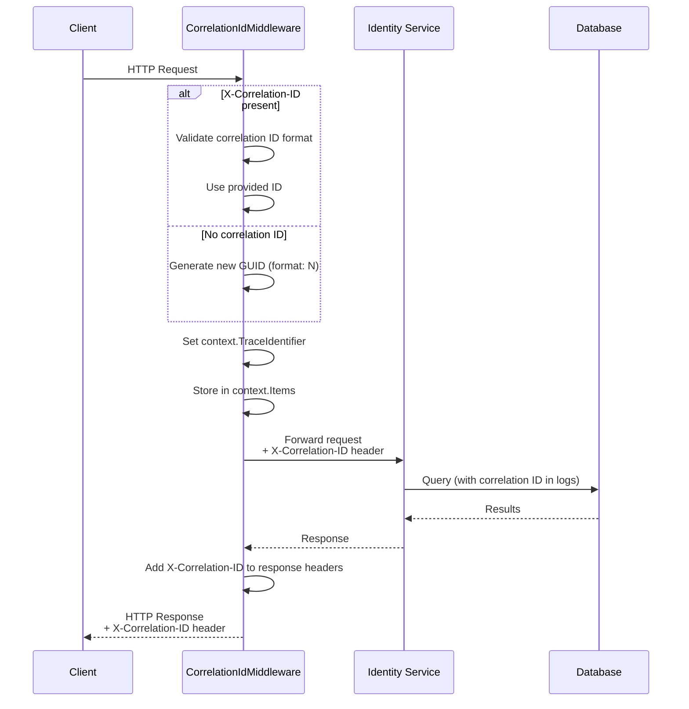
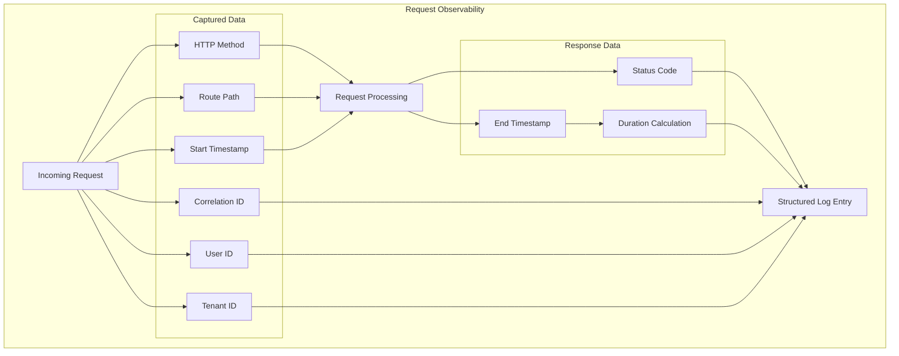

# HCL.CS.SF Observability

**Document ID:** HCL.CS.SF-DOC-06-OBSERVABILITY  
**Version:** 1.0.0  
**Classification:** Internal Use  
**Last Updated:** 2026-03-01  

---

## Table of Contents

1. [Correlation ID Middleware](#1-correlation-id-middleware)
2. [Metrics and Instrumentation](#2-metrics-and-instrumentation)
3. [Request Observability Middleware](#3-request-observability-middleware)
4. [Log Redaction Rules](#4-log-redaction-rules)
5. [Health Checks](#5-health-checks)
6. [Structured Logging](#6-structured-logging)

---

## 1. Correlation ID Middleware

### 1.1 Purpose

The Correlation ID Middleware ensures every request can be traced end-to-end across the distributed system. It propagates a unique identifier from the gateway through all downstream services.

**Source:** `/src/Gateway/HCL.CS.SF.Gateway/Hosting/CorrelationIdMiddleware.cs`

### 1.2 Behavior



### 1.3 Header Specification

| Header | Direction | Format | Max Length |
|--------|-----------|--------|------------|
| `X-Correlation-ID` | Request/Response | Alphanumeric + `-`, `_`, `.` | 128 characters |

### 1.4 Correlation ID Generation

```csharp
// Format: 32-character hex string (no dashes)
private static string CreateCorrelationId()
{
    return Guid.NewGuid().ToString("N");  // e.g., "a1b2c3d4e5f67890...
}
```

### 1.5 Validation Rules

**Source:** `/src/Gateway/HCL.CS.SF.Gateway/Hosting/CorrelationIdMiddleware.cs`

```csharp
private static bool IsValidCorrelationId(string correlationId)
{
    // Length check
    if (correlationId.Length is <= 0 or > 128) return false;
    
    // Character validation
    foreach (var character in correlationId)
    {
        if (char.IsLetterOrDigit(character)) continue;
        if (character is '-' or '_' or '.') continue;
        return false;
    }
    
    return true;
}
```

### 1.6 Propagation

The correlation ID is propagated through:
- HTTP request headers to downstream services
- `HttpContext.TraceIdentifier` for ASP.NET Core logging
- `HttpContext.Items` for in-process access
- Response headers back to the client

---

## 2. Metrics and Instrumentation

### 2.1 HCL.CS.SFMetrics Class

**Source:** `/src/Gateway/HCL.CS.SF.Gateway/Hosting/HCL.CS.SFMetrics.cs`

```csharp
internal static class HCL.CS.SFMetrics
{
    private static readonly Meter Meter = new("HCL.CS.SF.Hosting.Observability", "1.0.0");
    
    // Request counter
    private static readonly Counter<long> RequestCounter =
        Meter.CreateCounter<long>("HCL.CS.SF.http.server.requests");
    
    // Request duration histogram
    private static readonly Histogram<double> RequestDurationMs =
        Meter.CreateHistogram<double>("HCL.CS.SF.http.server.duration.ms", "ms");
}
```

### 2.2 Recorded Metrics

| Metric Name | Type | Labels | Description |
|-------------|------|--------|-------------|
| `HCL.CS.SF.http.server.requests` | Counter | method, route, status_code | Total HTTP requests |
| `HCL.CS.SF.http.server.duration.ms` | Histogram | method, route, status_code | Request duration in milliseconds |

### 2.3 Metric Labels

| Label | Example Values | Description |
|-------|----------------|-------------|
| `method` | GET, POST, PUT, DELETE | HTTP method |
| `route` | security/authorize, api/users | Normalized route pattern |
| `status_code` | 200, 401, 500 | HTTP response status code |

### 2.4 Usage Example

```csharp
// Recording a request
HCL.CS.SFMetrics.RecordRequest(
    method: "POST",
    routeGroup: "security/token",
    statusCode: 200,
    durationMs: 145.5
);
```

### 2.5 Prometheus/OpenTelemetry Export

To export metrics, configure in `Program.cs`:

```csharp
// Add OpenTelemetry
builder.Services.AddOpenTelemetry()
    .WithMetrics(metrics =>
    {
        metrics.AddMeter("HCL.CS.SF.Hosting.Observability")
               .AddPrometheusExporter()
               .AddOtlpExporter();
    });
```

---

## 3. Request Observability Middleware

### 3.1 Purpose

Captures detailed request/response information for observability, including timing, status codes, and correlation tracking.

**Source:** `/src/Gateway/HCL.CS.SF.Gateway/Hosting/RequestObservabilityMiddleware.cs`

### 3.2 Captured Information



### 3.3 Log Entry Structure

```json
{
  "timestamp": "2026-03-01T12:34:56.789Z",
  "level": "Information",
  "message": "HTTP request processed",
  "properties": {
    "method": "POST",
    "route": "security/token",
    "statusCode": 200,
    "durationMs": 145.5,
    "correlationId": "a1b2c3d4e5f67890...",
    "userId": "anonymous",
    "tenantId": "[REDACTED]"
  }
}
```

### 3.4 Middleware Pipeline Order

The observability middleware executes in this order:

1. `CorrelationIdMiddleware` - Generate/validate correlation ID
2. `SecurityHeadersMiddleware` - Add security headers
3. `RequestObservabilityMiddleware` - Capture timing and logging
4. `HCL.CS.SFApiMiddleware` / `HCL.CS.SFEndpointMiddleware` - Process request

---

## 4. Log Redaction Rules

### 4.1 Purpose

Prevents sensitive data leakage in logs by automatically redacting known sensitive fields.

**Source:** `/src/Gateway/HCL.CS.SF.Gateway/Hosting/LogRedactionHelper.cs`

### 4.2 Sensitive Field Detection

```csharp
private static readonly HashSet<string> SensitiveFields = 
    new(StringComparer.OrdinalIgnoreCase)
{
    "password",
    "secret",
    "token",
    "authorization",
    "cookie",
    "apikey",
    "api_key",
    "email",
    "phone",
    "ssn"
};
```

### 4.3 Redaction Behavior

| Input | Field Name | Output |
|-------|------------|--------|
| `MySecret123` | `password` | `[REDACTED]` |
| `MySecret123` | `userPassword` | `[REDACTED]` |
| `Bearer eyJ...` | `authorization` | `[REDACTED]` |
| `user@example.com` | `email` | `[REDACTED]` |
| `john.doe` | `username` | `john.doe` (not sensitive) |

### 4.4 User ID Redaction

```csharp
internal static string GetSafeUserId(string? userId)
{
    if (string.IsNullOrWhiteSpace(userId)) return "anonymous";
    
    var trimmed = userId.Trim();
    
    // Length validation
    if (trimmed.Length > 64) return RedactedValue;
    
    // Email pattern check
    if (trimmed.Contains('@', StringComparison.Ordinal)) return RedactedValue;
    
    // Whitespace check
    if (trimmed.Any(char.IsWhiteSpace)) return RedactedValue;
    
    // Phone number pattern check
    if (PhoneLikeRegex().IsMatch(trimmed)) return RedactedValue;
    
    return trimmed;
}
```

### 4.5 Safe Field Values

| Field | Input | Output | Reason |
|-------|-------|--------|--------|
| Tenant ID | `tenant-123` | `[REDACTED]` | Sensitive |
| User ID (guid) | `a1b2c3d4...` | `a1b2c3d4...` | Safe |
| User ID (email) | `user@example.com` | `[REDACTED]` | Contains email |
| User ID (long) | `a1b2... (100 chars)` | `[REDACTED]` | Too long |

### 4.6 Usage in Logging

```csharp
// Example usage in middleware
logger.LogInformation(
    "Request from user {UserId} in tenant {TenantId}",
    LogRedactionHelper.GetSafeUserId(userId),
    LogRedactionHelper.GetSafeTenantId(tenantId)
);
// Logs: "Request from user a1b2c3d4 in tenant [REDACTED]"
```

---

## 5. Health Checks

### 5.1 Overview

Health checks provide operational visibility into system dependencies and readiness to serve traffic.

**Source:** `/src/Identity/HCL.CS.SF.Identity.API/Health/`

### 5.2 Health Endpoints

| Endpoint | Purpose | Implementation |
|----------|---------|----------------|
| `/health/live` | Liveness probe | Process health |
| `/health/ready` | Readiness probe | Dependency health |

### 5.3 Database Health Check

**Source:** `/src/Identity/HCL.CS.SF.Identity.API/Health/DatabaseDependencyHealthCheck.cs`

```csharp
public class DatabaseDependencyHealthCheck : IHealthCheck
{
    private static readonly TimeSpan DependencyTimeout = TimeSpan.FromSeconds(2);
    
    public async Task<HealthCheckResult> CheckHealthAsync(
        HealthCheckContext context,
        CancellationToken cancellationToken = default)
    {
        using var timeoutToken = CancellationTokenSource.CreateLinkedTokenSource(cancellationToken);
        timeoutToken.CancelAfter(DependencyTimeout);
        
        try
        {
            // Simple query to verify connectivity
            _ = await dbContext.Users.AnyAsync(timeoutToken.Token);
            return HealthCheckResult.Healthy("Database reachable.");
        }
        catch (OperationCanceledException) when (!cancellationToken.IsCancellationRequested)
        {
            return HealthCheckResult.Unhealthy("Database health check timed out.");
        }
        catch
        {
            return HealthCheckResult.Unhealthy("Database health check failed.");
        }
    }
}
```

### 5.4 Cache Health Check

**Source:** `/src/Identity/HCL.CS.SF.Identity.API/Health/CacheDependencyHealthCheck.cs`

| Check | Timeout | Success Criteria |
|-------|---------|------------------|
| Cache round-trip | 2 seconds | Set and retrieve test value |

### 5.5 Health Response Format

**Healthy Response (200 OK):**
```json
{
  "status": "Healthy",
  "totalDuration": "00:00:00.045",
  "entries": {
    "database": {
      "status": "Healthy",
      "description": "Database reachable.",
      "duration": "00:00:00.023"
    },
    "cache": {
      "status": "Healthy",
      "description": "Cache reachable.",
      "duration": "00:00:00.018"
    }
  }
}
```

**Unhealthy Response (503 Service Unavailable):**
```json
{
  "status": "Unhealthy",
  "totalDuration": "00:00:02.045",
  "entries": {
    "database": {
      "status": "Unhealthy",
      "description": "Database health check timed out.",
      "duration": "00:00:02.001"
    }
  }
}
```

### 5.6 Kubernetes Integration

```yaml
# From k8s/identity-deployment.yaml
livenessProbe:
  httpGet:
    path: /health/live
    port: 8080
  initialDelaySeconds: 10
  periodSeconds: 10

readinessProbe:
  httpGet:
    path: /health/ready
    port: 8080
  initialDelaySeconds: 5
  periodSeconds: 5
```

### 5.7 Health Check Timeouts

| Dependency | Timeout | Rationale |
|------------|---------|-----------|
| Database | 2 seconds | Avoid hanging probes during high load |
| Cache | 2 seconds | Prevent cascading failures |

---

## 6. Structured Logging

### 6.1 Log Levels

| Level | Usage |
|-------|-------|
| `Critical` | System failure requiring immediate attention |
| `Error` | Operation failed, but system continues |
| `Warning` | Unexpected condition, potential issue |
| `Information` | Normal operational events |
| `Debug` | Detailed diagnostic information |
| `Trace` | Very detailed diagnostic (development only) |

### 6.2 Log Categories

**Source:** `/src/Identity/HCL.CS.SF.Identity.Domain/LogConfig.cs`

| Category | Purpose | Example Events |
|----------|---------|----------------|
| `Default` | General application logging | Startup, configuration |
| `Security` | Security-related events | Login failures, token validation |
| `Audit` | Audit trail | User actions, data changes |

### 6.3 Standard Log Properties

Every log entry includes:
- `Timestamp` - UTC timestamp
- `Level` - Log level
- `Message` - Human-readable message
- `CorrelationId` - Request correlation ID
- `Category` - Log category
- `Exception` - Exception details (if applicable)

### 6.4 Security Event Logging

| Event | Level | Properties |
|-------|-------|------------|
| Token issued | Information | client_id, grant_type, scopes |
| Token revoked | Information | client_id, token_type_hint |
| Failed authentication | Warning | username, reason, client_ip |
| Token reuse detected | Warning | client_id, subject_id |
| Invalid client credentials | Warning | client_id, client_ip |
| Authorization code replay | Warning | client_id, code_hash |

### 6.5 Log Configuration

**appsettings.json:**
```json
{
  "Logging": {
    "LogLevel": {
      "Default": "Information",
      "Microsoft.AspNetCore": "Warning",
      "HCL.CS.SF": "Debug"
    },
    "Console": {
      "FormatterName": "json",
      "FormatterOptions": {
        "SingleLine": true,
        "IncludeScopes": true,
        "TimestampFormat": "yyyy-MM-ddTHH:mm:ss.fffZ"
      }
    }
  }
}
```

### 6.6 Safe Logging Checklist

When adding new log statements:

- [ ] No passwords or secrets logged
- [ ] No full tokens logged (truncated OK)
- [ ] No PII (email, phone) in production logs
- [ ] Use `LogRedactionHelper` for user/tenant IDs
- [ ] Correlation ID included
- [ ] Appropriate log level selected

---

## 7. Tracing and Diagnostics

### 7.1 ActivitySource Integration

HCL.CS.SF uses `System.Diagnostics.Activity` for distributed tracing:

```csharp
// Example activity creation
using var activity = new Activity("HCL.CS.SF.TokenEndpoint");
activity.SetTag("client_id", clientId);
activity.SetTag("grant_type", grantType);
activity.Start();

// ... processing ...

activity.SetTag("result", "success");
```

### 7.2 OpenTelemetry Configuration

```csharp
builder.Services.AddOpenTelemetry()
    .WithTracing(tracing =>
    {
        tracing.AddAspNetCoreInstrumentation()
               .AddHttpClientInstrumentation()
               .AddEntityFrameworkCoreInstrumentation()
               .AddSource("HCL.CS.SF.Identity")
               .AddOtlpExporter();
    });
```

---

## 8. Monitoring Recommendations

### 8.1 Recommended Alerts

| Alert | Condition | Severity |
|-------|-----------|----------|
| High Error Rate | 5xx > 1% over 5 min | Critical |
| Readiness Failure | /health/ready fails 3x | Critical |
| High Latency | p95 > 500ms for 5 min | Warning |
| Token Replay | Reuse detected | Warning |
| Failed Auth Spike | Failed auth > 100/min | Warning |

### 8.2 Dashboard Metrics

| Panel | Query | Visualization |
|-------|-------|---------------|
| Request Rate | `rate(HCL.CS.SF_http_server_requests[1m])` | Line graph |
| Error Rate | `rate(HCL.CS.SF_http_server_requests{status_code=~"5.."}[1m])` | Line graph |
| Latency p95 | `histogram_quantile(0.95, HCL.CS.SF_http_server_duration_ms)` | Line graph |
| Health Status | `up{job="HCL.CS.SF-identity"}` | Status panel |

---

## Version History

| Version | Date | Author | Changes |
|---------|------|--------|---------|
| 1.0.0 | 2026-03-01 | Enterprise Documentation Team | Initial release |
