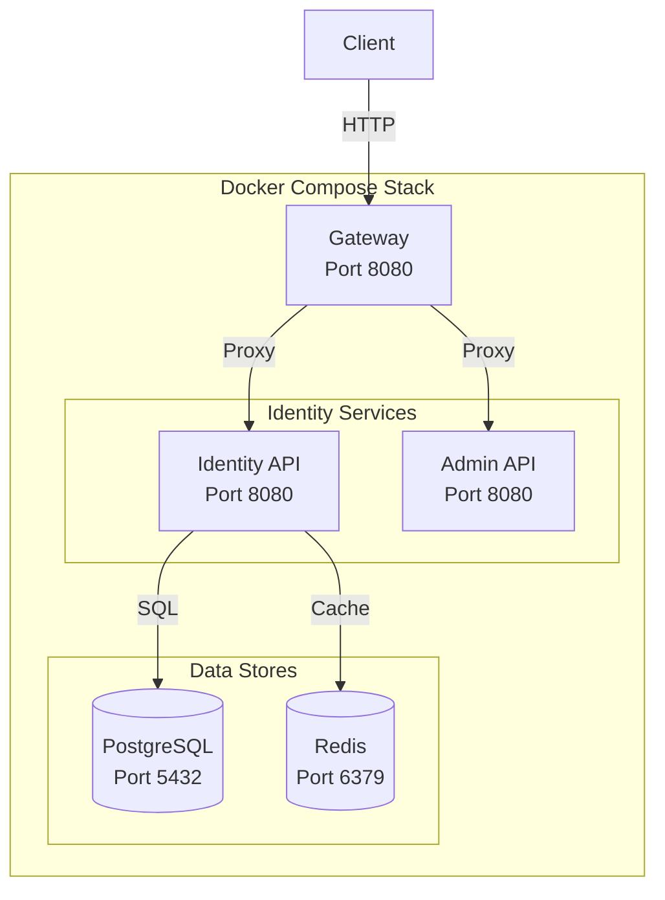
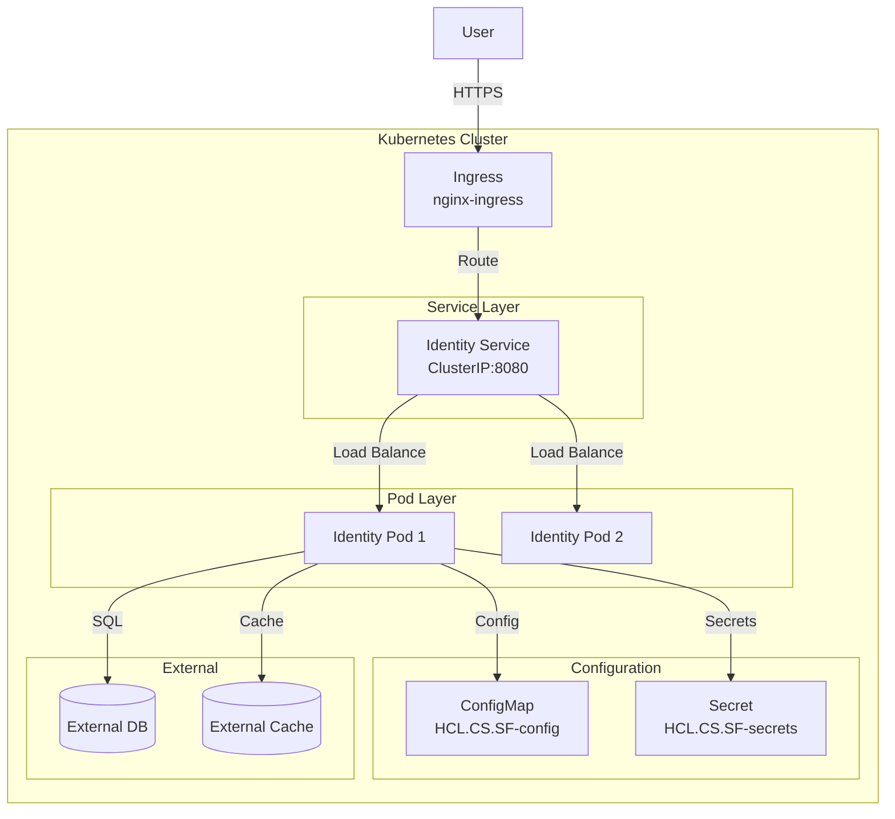
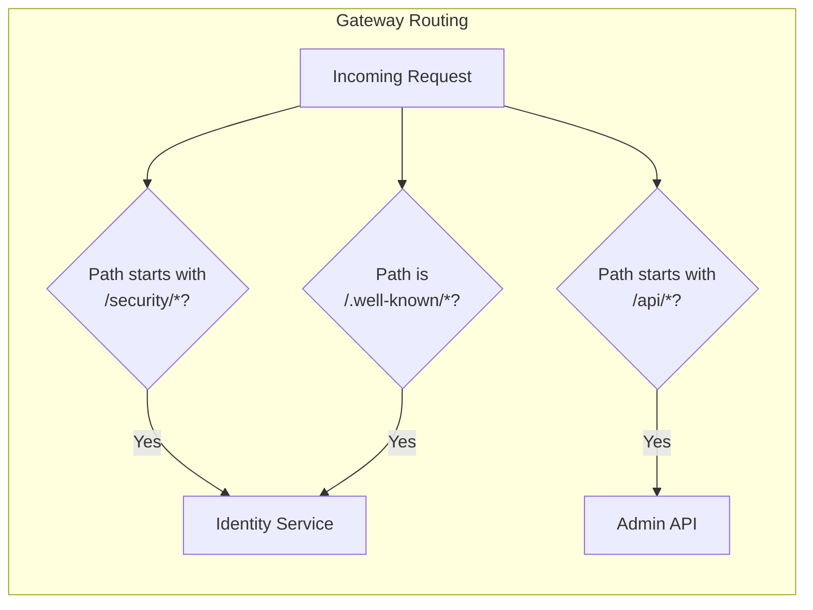

# HCL.CS.SF Deployment Guide

**Document ID:** HCL.CS.SF-DOC-07-DEPLOYMENT  
**Version:** 1.0.0  
**Classification:** Internal Use  
**Last Updated:** 2026-03-01  

---

## Table of Contents

1. [Local Development](#1-local-development)
2. [Docker Compose Deployment](#2-docker-compose-deployment)
3. [Kubernetes Deployment](#3-kubernetes-deployment)
4. [Environment Configuration](#4-environment-configuration)
5. [Ports and Routing](#5-ports-and-routing)
6. [Secret Handling](#6-secret-handling)
7. [Troubleshooting](#7-troubleshooting)

---

## 1. Local Development

### 1.1 Prerequisites

| Requirement | Version | Verification |
|-------------|---------|--------------|
| .NET SDK | 8.0.x | `dotnet --version` |
| SQLite (optional) | 3.x | Built-in for local dev |
| SQL Server/PostgreSQL (optional) | Latest | For provider testing |
| Node.js (for frontend) | 18.x+ | `node --version` |

### 1.2 Quick Start

```bash
# 1. Clone repository
git clone <repository-url>
cd HCL.CS.SF

# 2. Restore dependencies
dotnet restore HCL.CS.SF.sln

# 3. Build solution
dotnet build HCL.CS.SF.sln

# 4. Run with demo script
./scripts/run-local-demo.sh \
  --client-id "demo-client" \
  --client-secret "demo-secret"
```

### 1.3 Running Services Individually

#### Identity Server (Demo)
```bash
dotnet run \
  --project demos/HCL.CS.SF.Demo.Server/HCL.CS.SF.DemoServerApp.csproj \
  --launch-profile "HCL.CS.SF.DemoServerApp"
```
- URL: `https://localhost:5001`
- Discovery: `https://localhost:5001/.well-known/openid-configuration`

#### Installer MVC
```bash
dotnet run \
  --project installer/HCL.CS.SF.Installer.Mvc/HCL.CS.SFInstallerMVC.csproj \
  --launch-profile "https"
```
- URL: `https://localhost:7039`

#### MVC Client (Demo)
```bash
dotnet run \
  --project demos/HCL.CS.SF.Demo.Client.Mvc/HCL.CS.SF.DemoClientMvc.csproj \
  --launch-profile "HCL.CS.SF.DemoClientCoreMvcApp"
```
- URL: `https://localhost:5003`

### 1.4 Development Database

Default development uses SQLite:

```json
// appsettings.Development.json
{
  "ConnectionStrings": {
    "DefaultConnection": "Data Source=.data/HCL.CS.SF_identity.db;Mode=ReadWriteCreate;Cache=Shared;"
  }
}
```

SQLite database location: `./.data/HCL.CS.SF_identity.db`

---

## 2. Docker Compose Deployment

### 2.1 Architecture



### 2.2 Docker Files

| File | Purpose | Base Image |
|------|---------|------------|
| `docker/identity-api.Dockerfile` | Identity API container | `mcr.microsoft.com/dotnet/aspnet:8.0` |
| `docker/admin-api.Dockerfile` | Admin API container | `mcr.microsoft.com/dotnet/aspnet:8.0` |
| `docker/gateway.Dockerfile` | Gateway container | `mcr.microsoft.com/dotnet/aspnet:8.0` |

**Source:** `/docker/identity-api.Dockerfile` (example)

```dockerfile
FROM mcr.microsoft.com/dotnet/aspnet:8.0 AS base
WORKDIR /app
EXPOSE 8080

FROM mcr.microsoft.com/dotnet/sdk:8.0 AS build
WORKDIR /src
COPY ["src/Identity/HCL.CS.SF.Identity.API/HCL.CS.SF.Hosting.csproj", "src/Identity/HCL.CS.SF.Identity.API/"]
# ... additional COPY commands for dependencies
RUN dotnet restore "src/Identity/HCL.CS.SF.Identity.API/HCL.CS.SF.Hosting.csproj"
COPY . .
WORKDIR "/src/src/Identity/HCL.CS.SF.Identity.API"
RUN dotnet build "HCL.CS.SF.Hosting.csproj" -c Release -o /app/build

FROM build AS publish
RUN dotnet publish "HCL.CS.SF.Hosting.csproj" -c Release -o /app/publish

FROM base AS final
WORKDIR /app
COPY --from=publish /app/publish .
ENTRYPOINT ["dotnet", "HCL.CS.SF.Hosting.dll"]
```

### 2.3 Docker Compose Configuration

**Source:** `/docker/docker-compose.yml`

```yaml
version: '3.9'

services:
  identity-api:
    build:
      context: ..
      dockerfile: docker/identity-api.Dockerfile
    image: HCL.CS.SF/identity-api:local
    ports:
      - '8080:8080'
    environment:
      ASPNETCORE_ENVIRONMENT: Development
      ConnectionStrings__DefaultConnection: "Host=postgres;Database=HCL.CS.SFIdentity;Username=HCL.CS.SF;Password=${DB_PASSWORD}"
    depends_on:
      - postgres
      - redis

  postgres:
    image: postgres:16-alpine
    environment:
      POSTGRES_USER: HCL.CS.SF
      POSTGRES_PASSWORD: ${DB_PASSWORD}
      POSTGRES_DB: HCL.CS.SFIdentity
    volumes:
      - postgres_data:/var/lib/postgresql/data
    ports:
      - '5432:5432'

  redis:
    image: redis:7-alpine
    ports:
      - '6379:6379'

volumes:
  postgres_data:
```

### 2.4 Running Docker Compose

```bash
# 1. Navigate to docker directory
cd docker

# 2. Create .env file
cat > .env << EOF
DB_PASSWORD=SecurePassword123!
EOF

# 3. Build and start services
docker-compose up --build -d

# 4. Verify services
docker-compose ps

# 5. View logs
docker-compose logs -f identity-api

# 6. Stop services
docker-compose down

# 7. Stop and remove volumes (destructive)
docker-compose down -v
```

### 2.5 Docker Compose Environment Variables

| Variable | Required | Description |
|----------|----------|-------------|
| `DB_PASSWORD` | Yes | PostgreSQL password |
| `ASPNETCORE_ENVIRONMENT` | No | `Development` or `Production` |
| `ConnectionStrings__DefaultConnection` | No | Override connection string |

---

## 3. Kubernetes Deployment

### 3.1 Architecture



### 3.2 Kubernetes Manifests

| File | Resource | Purpose |
|------|----------|---------|
| `k8s/configmap.yaml` | ConfigMap | Non-sensitive configuration |
| `k8s/identity-deployment.yaml` | Deployment | Identity API pods |
| `k8s/identity-service.yaml` | Service | Internal service discovery |
| `k8s/ingress.yaml` | Ingress | External routing |

### 3.3 ConfigMap

**Source:** `/k8s/configmap.yaml`

```yaml
apiVersion: v1
kind: ConfigMap
metadata:
  name: HCL.CS.SF-config
data:
  ASPNETCORE_ENVIRONMENT: "Production"
  TokenSettings__TokenConfig__IssuerUri: "https://identity.HCL.CS.SF.example"
  Logging__LogLevel__Default: "Information"
```

### 3.4 Deployment

**Source:** `/k8s/identity-deployment.yaml`

```yaml
apiVersion: apps/v1
kind: Deployment
metadata:
  name: HCL.CS.SF-identity
  labels:
    app: HCL.CS.SF-identity
spec:
  replicas: 2
  selector:
    matchLabels:
      app: HCL.CS.SF-identity
  template:
    metadata:
      labels:
        app: HCL.CS.SF-identity
    spec:
      containers:
        - name: identity-api
          image: HCL.CS.SF/identity-api:latest
          imagePullPolicy: IfNotPresent
          ports:
            - containerPort: 8080
          envFrom:
            - configMapRef:
                name: HCL.CS.SF-config
          env:
            - name: ConnectionStrings__DefaultConnection
              valueFrom:
                secretKeyRef:
                  name: HCL.CS.SF-secrets
                  key: db-connection
          livenessProbe:
            httpGet:
              path: /health/live
              port: 8080
            initialDelaySeconds: 10
            periodSeconds: 10
          readinessProbe:
            httpGet:
              path: /health/ready
              port: 8080
            initialDelaySeconds: 5
            periodSeconds: 5
          resources:
            requests:
              memory: "256Mi"
              cpu: "250m"
            limits:
              memory: "512Mi"
              cpu: "500m"
```

### 3.5 Service

**Source:** `/k8s/identity-service.yaml`

```yaml
apiVersion: v1
kind: Service
metadata:
  name: HCL.CS.SF-identity
  labels:
    app: HCL.CS.SF-identity
spec:
  type: ClusterIP
  ports:
    - port: 8080
      targetPort: 8080
      protocol: TCP
      name: http
  selector:
    app: HCL.CS.SF-identity
```

### 3.6 Ingress

**Source:** `/k8s/ingress.yaml`

```yaml
apiVersion: networking.k8s.io/v1
kind: Ingress
metadata:
  name: HCL.CS.SF-ingress
  annotations:
    nginx.ingress.kubernetes.io/ssl-redirect: "true"
    nginx.ingress.kubernetes.io/proxy-body-size: "10m"
    cert-manager.io/cluster-issuer: "letsencrypt-prod"
spec:
  ingressClassName: nginx
  tls:
    - hosts:
        - identity.HCL.CS.SF.example
      secretName: HCL.CS.SF-tls
  rules:
    - host: identity.HCL.CS.SF.example
      http:
        paths:
          - path: /
            pathType: Prefix
            backend:
              service:
                name: HCL.CS.SF-identity
                port:
                  number: 8080
```

### 3.7 Deploying to Kubernetes

```bash
# 1. Create namespace
kubectl create namespace HCL.CS.SF

# 2. Create secrets
kubectl create secret generic HCL.CS.SF-secrets \
  --from-literal=db-connection="Server=postgres.example.com;Database=HCL.CS.SFIdentity;..." \
  --from-literal=signing-key="..." \
  -n HCL.CS.SF

# 3. Apply manifests
kubectl apply -f k8s/configmap.yaml -n HCL.CS.SF
kubectl apply -f k8s/identity-deployment.yaml -n HCL.CS.SF
kubectl apply -f k8s/identity-service.yaml -n HCL.CS.SF
kubectl apply -f k8s/ingress.yaml -n HCL.CS.SF

# 4. Verify deployment
kubectl get pods -n HCL.CS.SF
kubectl get svc -n HCL.CS.SF
kubectl get ingress -n HCL.CS.SF

# 5. View logs
kubectl logs -f deployment/HCL.CS.SF-identity -n HCL.CS.SF

# 6. Scale deployment
kubectl scale deployment HCL.CS.SF-identity --replicas=3 -n HCL.CS.SF
```

### 3.8 Kubernetes Resource Recommendations

| Environment | Replicas | CPU Request | CPU Limit | Memory Request | Memory Limit |
|-------------|----------|-------------|-----------|----------------|--------------|
| Development | 1 | 100m | 250m | 128Mi | 256Mi |
| Staging | 2 | 250m | 500m | 256Mi | 512Mi |
| Production | 3+ | 500m | 1000m | 512Mi | 1Gi |

---

## 4. Environment Configuration

### 4.1 Configuration Hierarchy

```mermaid
flowchart TB
    subgraph "Configuration Sources"
        direction TB
        DEFAULT[appsettings.json]
        ENV[appsettings.{Environment}.json]
        ENVVAR[Environment Variables]
        CLI[Command Line Args]
    end
    
    DEFAULT --> ENV
    ENV --> ENVVAR
    ENVVAR --> CLI
    CLI --> FINAL[Final Configuration]
```

### 4.2 appsettings.json Structure

```json
{
  "ConnectionStrings": {
    "DefaultConnection": "..."
  },
  "TokenSettings": {
    "TokenConfig": {
      "IssuerUri": "https://identity.HCL.CS.SF.example",
      "ShowKeySet": true,
      "CachingLifetime": 3600
    },
    "TokenExpiration": {
      "AccessTokenExpiration": 300,
      "RefreshTokenExpiration": 86400,
      "IdentityTokenExpiration": 300
    }
  },
  "Logging": {
    "LogLevel": {
      "Default": "Information",
      "Microsoft.AspNetCore": "Warning"
    }
  },
  "AllowedHosts": "*"
}
```

### 4.3 Environment Variable Mapping

| appsettings.json Path | Environment Variable |
|----------------------|---------------------|
| `ConnectionStrings:DefaultConnection` | `ConnectionStrings__DefaultConnection` |
| `TokenSettings:TokenConfig:IssuerUri` | `TokenSettings__TokenConfig__IssuerUri` |
| `Logging:LogLevel:Default` | `Logging__LogLevel__Default` |

### 4.4 Required Configuration

| Setting | Purpose | Example |
|---------|---------|---------|
| `ConnectionStrings:DefaultConnection` | Database connection | Provider-specific |
| `TokenSettings:TokenConfig:IssuerUri` | JWT issuer claim | `https://identity.example.com` |
| `TokenSettings:TokenConfig:SigningKey` | JWT signing key | Key ID reference |

### 4.5 Optional Configuration

| Setting | Default | Purpose |
|---------|---------|---------|
| `TokenSettings:TokenConfig:ShowKeySet` | `true` | Enable JWKS endpoint |
| `TokenSettings:TokenConfig:CachingLifetime` | `3600` | Discovery cache duration |
| `Logging:LogLevel:Default` | `Information` | Minimum log level |

---

## 5. Ports and Routing

### 5.1 Default Ports

| Service | Development URL | Container Port | Description |
|---------|-----------------|----------------|-------------|
| Identity API | `https://localhost:5001` | 8080 | OAuth/OIDC endpoints |
| Admin API | `https://localhost:5002` | 8080 | Admin operations |
| Gateway | `https://localhost:8080` | 8080 | Reverse proxy |
| Installer | `https://localhost:7039` | 8080 | Setup wizard |

### 5.2 Endpoint Routes

| Endpoint | Route | Methods |
|----------|-------|---------|
| Discovery | `/.well-known/openid-configuration` | GET |
| JWKS | `/.well-known/openid-configuration/jwks` | GET |
| Authorize | `/security/authorize` | GET, POST |
| Token | `/security/token` | POST |
| UserInfo | `/security/userinfo` | GET, POST |
| Introspection | `/security/introspect` | POST |
| Revocation | `/security/revocation` | POST |
| End Session | `/security/endsession` | GET |

### 5.3 Gateway Routing



---

## 6. Secret Handling

### 6.1 Secret Categories

| Secret Type | Examples | Storage |
|-------------|----------|---------|
| Database credentials | Connection strings | Environment variables / Secret stores |
| JWT signing keys | RSA private keys | Key vault / File mount |
| Client secrets | OAuth client secrets | Database (hashed) |
| SMTP credentials | Username, password | Environment variables |
| API keys | External service keys | Secret stores |

### 6.2 Local Development Secrets

**User Secrets (Recommended for local dev):**
```bash
# Initialize user secrets
dotnet user-secrets init --project src/Identity/HCL.CS.SF.Identity.API

# Set secrets
dotnet user-secrets set "ConnectionStrings:DefaultConnection" "..." \
  --project src/Identity/HCL.CS.SF.Identity.API

dotnet user-secrets set "TokenSettings:TokenConfig:SigningKey" "..." \
  --project src/Identity/HCL.CS.SF.Identity.API
```

### 6.3 Docker Secrets

```yaml
# docker-compose.yml
services:
  identity-api:
    secrets:
      - db_password
      - signing_key

secrets:
  db_password:
    file: ./secrets/db_password.txt
  signing_key:
    file: ./secrets/signing_key.pem
```

### 6.4 Kubernetes Secrets

```bash
# Create secret from literal
kubectl create secret generic HCL.CS.SF-secrets \
  --from-literal=db-connection="..." \
  -n HCL.CS.SF

# Create secret from file
kubectl create secret generic HCL.CS.SF-keys \
  --from-file=signing-key.pem=./keys/private.pem \
  -n HCL.CS.SF
```

```yaml
# Mount secret as environment variable
env:
  - name: ConnectionStrings__DefaultConnection
    valueFrom:
      secretKeyRef:
        name: HCL.CS.SF-secrets
        key: db-connection

# Mount secret as file
volumeMounts:
  - name: signing-key
    mountPath: /app/keys
    readOnly: true

volumes:
  - name: signing-key
    secret:
      secretName: HCL.CS.SF-keys
```

### 6.5 Cloud Secret Management

| Platform | Service | Integration |
|----------|---------|-------------|
| Azure | Azure Key Vault | `Azure.Extensions.AspNetCore.Configuration.Secrets` |
| AWS | AWS Secrets Manager | `Amazon.Extensions.Configuration.SecretsManager` |
| GCP | Secret Manager | `Google.Cloud.SecretManager.V1` |

### 6.6 Secret Rotation

| Secret Type | Rotation Frequency | Process |
|-------------|-------------------|---------|
| Database credentials | 90 days | Update secret store, rolling restart |
| JWT signing keys | 180 days | Key rotation with overlap period |
| Client secrets | On demand | Regenerate in Admin API |
| API keys | Per vendor policy | Update secret store |

---

## 7. Troubleshooting

### 7.1 Common Issues

#### Database Connection Failed

**Symptoms:**
- Health check reports database unhealthy
- Application fails to start
- Error: "A network-related or instance-specific error..."

**Resolution:**
```bash
# Verify connection string
echo $ConnectionStrings__DefaultConnection

# Test database connectivity
docker exec -it postgres psql -U HCL.CS.SF -d HCL.CS.SFIdentity -c "SELECT 1;"

# Check firewall rules
# Ensure container/host can reach database port
```

#### JWT Signing Key Not Found

**Symptoms:**
- Token generation fails
- Error: "Key not found" or "Signing credentials unavailable"

**Resolution:**
```bash
# Verify key storage location
ls -la /app/keys/

# Check key permissions (should be readable by app)
chmod 600 /app/keys/*.pem

# Verify configuration
# TokenSettings__TokenConfig__SigningKey should point to correct key
```

#### Certificate Validation Errors

**Symptoms:**
- HTTPS requests fail
- Error: "The remote certificate is invalid..."

**Resolution:**
```bash
# For development: Trust dev certificate
dotnet dev-certs https --trust

# For production: Ensure valid certificate chain
# Verify certificate hasn't expired
openssl x509 -in cert.pem -noout -dates
```

### 7.2 Log Analysis

```bash
# View recent logs
docker-compose logs --tail=100 identity-api

# Filter for errors
docker-compose logs identity-api | grep -i error

# Follow logs
docker-compose logs -f identity-api

# Search by correlation ID
kubectl logs -n HCL.CS.SF deployment/HCL.CS.SF-identity | grep "correlation-id-value"
```

### 7.3 Health Check Failures

| Check | Failure Cause | Resolution |
|-------|---------------|------------|
| Database | Connection timeout | Check network, credentials, DB server |
| Cache | Redis unavailable | Verify Redis connection string |

### 7.4 Performance Issues

| Symptom | Cause | Resolution |
|---------|-------|------------|
| High latency | Database slow queries | Add indexes, optimize queries |
| Memory growth | Connection leaks | Check connection pooling settings |
| CPU spikes | Token generation load | Scale horizontally |

### 7.5 Recovery Procedures

#### Rolling Restart

```bash
# Docker Compose
docker-compose restart identity-api

# Kubernetes
kubectl rollout restart deployment/HCL.CS.SF-identity -n HCL.CS.SF
kubectl rollout status deployment/HCL.CS.SF-identity -n HCL.CS.SF
```

#### Database Recovery

```bash
# Restore from backup (PostgreSQL example)
pg_restore -U HCL.CS.SF -d HCL.CS.SFIdentity --clean backup.dump

# Run pending migrations
dotnet ef database update \
  --project src/Identity/HCL.CS.SF.Identity.Persistence \
  --startup-project src/Identity/HCL.CS.SF.Identity.API
```

---

## Version History

| Version | Date | Author | Changes |
|---------|------|--------|---------|
| 1.0.0 | 2026-03-01 | Enterprise Documentation Team | Initial release |
