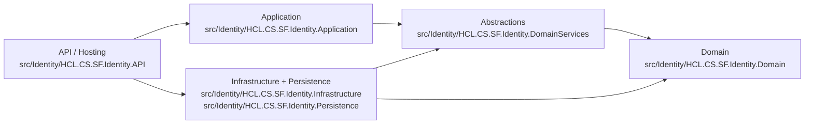

# Architecture Map

## Layer Boundaries

## Initial Violations Found

1. API contained direct database connection access.
   - `src/Identity/HCL.CS.SF.Identity.API/Extensions/HCL.CS.SFExtension.cs`
2. Application services contained direct EF-Core query/update operations.
   - `src/Identity/HCL.CS.SF.Identity.Application/Implementation/Api/Services/RoleService.cs`
   - `src/Identity/HCL.CS.SF.Identity.Application/Implementation/Api/Services/UserAccountService.cs`
   - `src/Identity/HCL.CS.SF.Identity.Application/Implementation/Endpoint/Services/AuthorizationService.cs`
   - `src/Identity/HCL.CS.SF.Identity.Application/Implementation/Endpoint/Services/TokenGenerationService.cs`
3. Tenant context abstraction was missing from application-facing dependencies.

## Violations Resolved

1. Moved API DB connectivity checks behind abstraction.
   - Added abstraction: `src/Identity/HCL.CS.SF.Identity.DomainServices/Infra/IDbConnectionValidator.cs`
   - Added implementation: `src/Identity/HCL.CS.SF.Identity.Persistence/Validation/DbConnectionValidator.cs`
   - API now depends on abstraction/concrete validator instead of raw SQL connection types:
     - `src/Identity/HCL.CS.SF.Identity.API/Extensions/HCL.CS.SFExtension.cs`

2. Removed direct EF operations from application orchestration services.
   - Added token command abstraction:
     - `src/Identity/HCL.CS.SF.Identity.DomainServices/Repository/Api/ISecurityTokenCommandRepository.cs`
   - Added token command implementation:
     - `src/Identity/HCL.CS.SF.Identity.Persistence/Repository/Api/SecurityTokenCommandRepository.cs`
   - Moved role existence check into repository abstraction:
     - Interface: `src/Identity/HCL.CS.SF.Identity.DomainServices/Repository/Api/IRoleRepository.cs`
     - Impl: `src/Identity/HCL.CS.SF.Identity.Persistence/Repository/Api/RoleRepository.cs`
   - Moved "find user including deleted" into repository abstraction:
     - Interface: `src/Identity/HCL.CS.SF.Identity.DomainServices/Repository/Api/IUserRepository.cs`
     - Impl: `src/Identity/HCL.CS.SF.Identity.Persistence/Repository/Api/UserRepository.cs`
   - Application services now call abstractions:
     - `src/Identity/HCL.CS.SF.Identity.Application/Implementation/Api/Services/RoleService.cs`
     - `src/Identity/HCL.CS.SF.Identity.Application/Implementation/Api/Services/UserAccountService.cs`
     - `src/Identity/HCL.CS.SF.Identity.Application/Implementation/Endpoint/Services/AuthorizationService.cs`
     - `src/Identity/HCL.CS.SF.Identity.Application/Implementation/Endpoint/Services/TokenGenerationService.cs`

3. Introduced tenant context abstraction and injected it through application-facing service graph.
   - Added abstraction: `src/Identity/HCL.CS.SF.Identity.DomainServices/Infra/ITenantContext.cs`
   - Added implementation: `src/Identity/HCL.CS.SF.Identity.Infrastructure/Implementation/HttpTenantContext.cs`
   - Registered in DI (composition root/infrastructure):
     - `src/Identity/HCL.CS.SF.Identity.Infrastructure/Extension/InfrastructureServiceExtension.cs`
   - Consumed by application service:
     - `src/Identity/HCL.CS.SF.Identity.Application/Implementation/Endpoint/Services/TokenGenerationService.cs`

4. Added architecture regression tests for required boundaries.
   - `tests/HCL.CS.SF.ArchitectureTests/LayerDependencyTests.cs`
   - `tests/HCL.CS.SF.ArchitectureTests/README.md`

