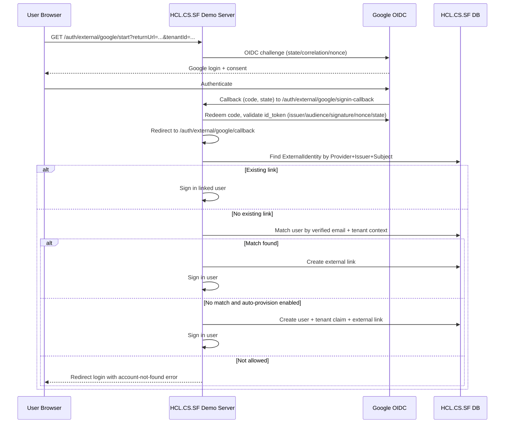

# Google Sign-In Integration (HCL.CS.SF)

## Overview

HCL.CS.SF now supports Google Sign-In in addition to Local and LDAP providers.

- Start endpoint: `GET /auth/external/google/start`
- Callback endpoint: `GET /auth/external/google/callback`
- Optional link endpoint: `POST /auth/external/link/google`
- Optional unlink endpoint: `POST /auth/external/unlink/google`

The implementation uses OpenID Connect Authorization Code flow with server-side code exchange and built-in state/nonce validation.

## Flow



## Tenant Mapping

Tenant context is carried using Option A:

1. Tenant is provided from `tenantId` query or resolved from existing runtime context (`X-Tenant-Id` / tenant claims).
2. Tenant context is stored in OIDC state (authentication properties).
3. Callback uses this tenant value for account matching/linking and policy checks.

Optional domain policy is also supported through configuration (`AllowedDomainsByTenant` and global `AllowedDomains`).

## Account Linking and Provisioning Rules

On first Google sign-in:

1. If `(Provider, Issuer, Subject)` exists, sign in linked user.
2. Else require `email_verified=true` and try to match existing user by email (tenant-aware).
3. If matched, link Google identity to user.
4. If no match, auto-provision only when enabled by policy.
5. If auto-provision is disabled, login fails with account-not-found message.

Linked external identities are stored in `HCL.CS.SF_ExternalIdentities`.

## Security Controls

- OIDC discovery document and keys from Google metadata endpoint.
- `id_token` validation:
  - issuer (`https://accounts.google.com` / `accounts.google.com`)
  - audience (configured Google client id)
  - signature and lifetime
  - nonce/state via OIDC middleware
- Correlation + nonce cookies are `HttpOnly`, `Secure`, `SameSite=None`.
- Redirect safety:
  - local return URLs preferred
  - absolute return URLs allowed only for configured `AllowedRedirectHosts`
- No access/refresh/id tokens are logged.
- Existing rate limiter includes Google start/callback endpoints.

## Configuration

Configure in `demos/HCL.CS.SF.Demo.Server/appsettings*.json` or environment overrides:

```json
{
  "Authentication": {
    "Google": {
      "Enabled": false,
      "ClientId": "",
      "ClientSecret": "",
      "Authority": "https://accounts.google.com",
      "MetadataAddress": "https://accounts.google.com/.well-known/openid-configuration",
      "CallbackPath": "/auth/external/google/signin-callback",
      "AllowedRedirectHosts": ["localhost"]
    },
    "ExternalAccount": {
      "AutoProvisionEnabled": false,
      "AllowedDomains": [],
      "AllowedDomainsByTenant": {}
    }
  }
}
```

Environment variable examples:

- `Authentication__Google__Enabled=true`
- `Authentication__Google__ClientId=<google-client-id>`
- `Authentication__Google__ClientSecret=<google-client-secret>`
- `Authentication__ExternalAccount__AutoProvisionEnabled=true`

## Google Cloud Console Setup

1. Create OAuth Client ID (Web application).
2. Add authorized redirect URI:
   - `https://<your-HCL.CS.SF-host>/auth/external/google/signin-callback`
3. Add authorized JavaScript origin if needed for your deployment.
4. Configure client id/secret in secure secret storage (not source control).

## Database Changes

`HCL.CS.SF_ExternalIdentities` added with:

- Unique: `(Provider, Issuer, Subject)`
- Indexes: `(UserId)`, `(TenantId, Email)`
- Fields: `Provider`, `Issuer`, `Subject`, `Email`, `EmailVerified`, `TenantId`, `LinkedAt`, `LastSignInAt`

Migration scripts are under `scripts/migrations/20260304_externalidentities_*.sql`.

## Troubleshooting

### HCL.CS.SF-admin: "This localhost page can't be found" (HTTP 404) when clicking "Sign in with Google"

The admin sends the browser to `{HCL.CS.SF_DEMO_SERVER_BASE_URL}/auth/external/google/start`. A 404 usually means one of:

1. **Wrong URL** – The URL is not the **HCL.CS.SF Demo Server** (the project that has the Google routes). The `/auth/external/google/start` route exists only in **HCL.CS.SF.Demo.Server**, not in the Identity API or Gateway alone.
   - **Fix:** Run the **Demo Server** project (`demos/HCL.CS.SF.Demo.Server`). If it runs on a different port than your issuer (e.g. Demo Server on `https://localhost:5002` and Identity on `https://localhost:5001`), set in the admin `.env`:
     - `HCL.CS.SF_DEMO_SERVER_BASE_URL=https://localhost:5002` (use the port where the Demo Server actually runs).

2. **Google sign-in disabled** – If the request reaches the Demo Server but Google is disabled, the server now returns **503** with the message "Google sign-in is not enabled" instead of 404.
   - **Fix:** In Demo Server config (e.g. `appsettings.Development.json` or environment), set:
     - `Authentication:Google:Enabled=true`
     - `Authentication:Google:ClientId=<your-google-client-id>`
     - `Authentication:Google:ClientSecret=<your-google-client-secret>`

3. **Demo Server not running** – Ensure the Demo Server app is started (e.g. run `demos/HCL.CS.SF.Demo.Server` and confirm it listens on the URL you use for `HCL.CS.SF_DEMO_SERVER_BASE_URL`).
